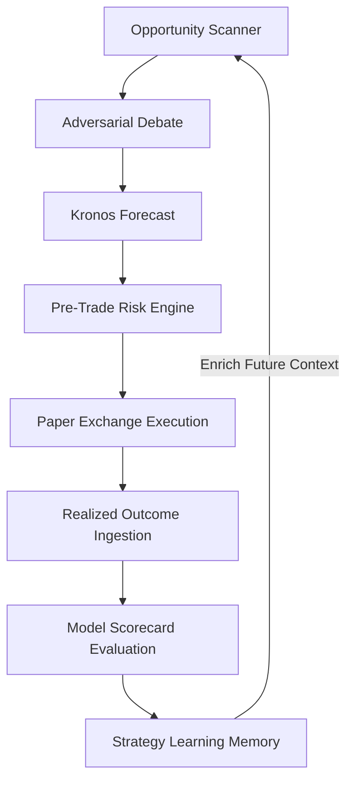

# AlphaMind AI — Self-Improving Strategy Learning & Memory System

AlphaMind AI incorporates an evaluation-driven strategy reflection loop inspired by reinforcement learning principles (FinRL) and episodic memory architectures.

---

## 1. Outcome-Driven Strategy Memory (`packages/memory/strategy_learning_memory.py`)

- **Safe Learning Principles**:
  - Strategy improvement occurs via contextual memory enrichment and empirical reflection—**never by mutating or rewriting production source code at runtime**.
- **Performance Profiling**:
  - Continuously tracks strategy metrics across market regimes:
    - Win Rate (%)
    - Profit Factor (Gross Gains / Gross Losses)
    - Realized Sharpe & Sortino Ratios
    - Maximum Historical Drawdown (%)
    - Alpha Generated vs S&P 500 benchmark
- **Regime-Specific Classification**:
  - Classifies market context into: `BULL_EXPANSION`, `BEAR_CONTRACTION`, `HIGH_VOLATILITY`, `RANGE_BOUND`.

---

## 2. Dialectical Feedback Loop

- When trades are executed and closed, reflections and post-mortem metrics are recorded.
- Subsequent research cycles ingest historical win rates and regime performance to calibrate risk allocations.
