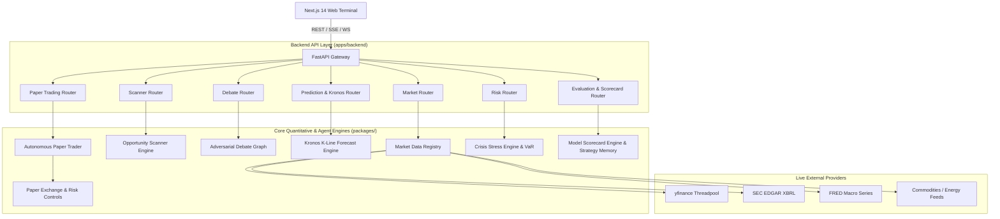

# AlphaMind AI — Institutional Trading Platform Architecture

AlphaMind AI is a production-grade autonomous financial intelligence and multi-asset paper trading operating system built on clean architecture, live market data ingestion, probabilistic foundation modeling, and rigorous risk controls.

---

## 1. System Topology & Layer Separation

---

## 2. Core Operational Guarantees

1. **Zero Synthetic Financial Data**:
   - Every price, volume, market cap, financial statement line, and indicator is derived from live upstream providers (`yfinance`, SEC EDGAR, FRED).
   - Every returned snapshot carries strict provenance metadata: `source`, `provider`, `retrieved_at`, `age_seconds`, `freshness` (`LIVE`, `DELAYED`, `CACHED`, `HISTORICAL`), and `is_stale`.

2. **Probabilistic Forecasting (No Deterministic Targets)**:
   - Prediction engines generate multi-scenario probability distributions (Bull, Base, Bear) and 95% confidence uncertainty envelopes.
   - All forecasting endpoints carry explicit SEC/FINRA disclosures.

3. **Autonomous Paper Trading & Risk Isolation**:
   - Virtual execution with dynamic slippage (2.0 bps), bid/ask spreads, fixed commissions ($1.00), and pre-trade risk controls (max position size, margin requirement, max portfolio drawdown).
   - Tagged exclusively as `[PAPER MODE]`.

4. **Self-Improving Strategy Memory**:
   - Outcome-based reflection recording trade results, market regimes, win rates, and profit factors to enrich future agent research cycles.
