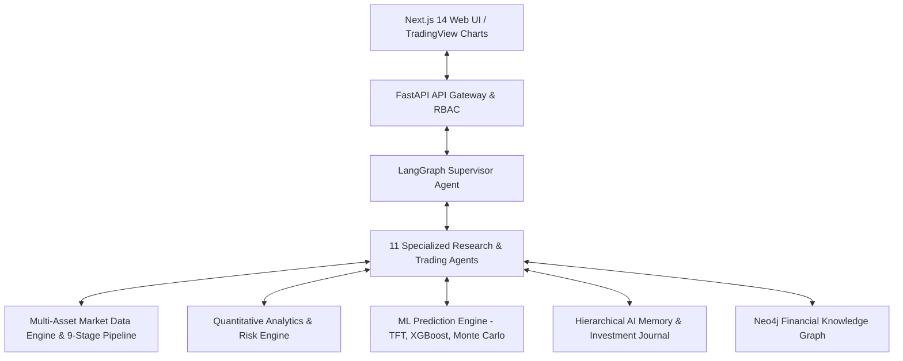

# AlphaMind AI - Autonomous AI Investment Research & Trading Platform

AlphaMind AI is an enterprise, institutional/hedge-fund-grade autonomous AI investment research, quantitative analytics, and trading execution platform. The platform operates on a **probability-based forecasting framework** (rejecting deterministic single-point target prices in favor of Bayesian confidence distributions, Monte Carlo risk surfaces, and scenario simulations).

---

## Executive Overview

AlphaMind AI leverages a **multi-agent system powered by LangGraph**, a **9-stage real-time data ingestion pipeline**, a **quantitative factor engine**, a **multi-model prediction engine** (Temporal Fusion Transformers, XGBoost, CatBoost, Bayesian inference), an **expanded financial knowledge graph**, **hierarchical AI memory**, and **explainable AI (XAI)**.

---

## Key Platform Capabilities

- **Probability-Based Forecasting**: Generates 95% confidence intervals, probability distribution curves (Bull/Base/Bear), and fat-tailed Monte Carlo simulations instead of static price targets.
- **11 Isolated Autonomous Agents**: Market Research, Company Research, News, Financial Statements, Technicals, Fundamentals, Macroeconomics, Portfolio, Risk, Prediction, and Report Generator.
- **Multi-Asset Market Data Engine**: Equities, ETFs, Futures, Options, Forex, Crypto, Bonds, Commodities, and Global Indices with automated 3-tier provider failover (`Polygon.io` $\rightarrow$ `Alpha Vantage` $\rightarrow$ `yfinance`).
- **Explainable AI (XAI)**: SHAP feature attribution, reasoning summaries, supporting vs. contradicting evidence matrices, known unknowns, and historical Brier Score calibration tracking.
- **Strict Compliance & Disclaimers**: Automatic SEC/FINRA financial research disclaimers, RBAC, Vault secrets, and audit logging.

---

## Technical Stack

| Layer | Technology |
| :--- | :--- |
| **Frontend** | Next.js 14+ (App Router), React 18, TypeScript 5, TailwindCSS, `shadcn/ui`, TradingView Lightweight Charts |
| **Backend API** | Python 3.11+, FastAPI, Pydantic v2, `asyncpg`, SQLAlchemy Async, Redis |
| **Databases** | PostgreSQL 16 + TimescaleDB (Time-series & relational), ChromaDB (Vector Store), Neo4j (Knowledge Graph) |
| **AI / Multi-Agent** | LangGraph, LangChain, OpenAI, Anthropic Claude, Google Gemini, DeepSeek, Ollama / vLLM |
| **ML & Quant** | PyTorch, `scikit-learn`, XGBoost, CatBoost, `pandas`, `numpy`, `pandas-ta`, `vectorbt`, `backtrader` |
| **Infrastructure** | Docker, Docker Compose, OpenTelemetry, Prometheus, Sentry, GitHub Actions |

---

## Architecture & Engineering Documentation

All comprehensive design and architectural documentation is maintained in the [`/docs`](file:///Users/kushal/Desktop/AlphaMind%20AI/docs) directory:

- [Project Roadmap](file:///Users/kushal/Desktop/AlphaMind%20AI/docs/02_PROJECT_ROADMAP.md)
- [System Architecture](file:///Users/kushal/Desktop/AlphaMind%20AI/docs/03_SYSTEM_ARCHITECTURE.md)
- [Database Design](file:///Users/kushal/Desktop/AlphaMind%20AI/docs/04_DATABASE_DESIGN.md)
- [API Design](file:///Users/kushal/Desktop/AlphaMind%20AI/docs/05_API_DESIGN.md)
- [Agent Architecture](file:///Users/kushal/Desktop/AlphaMind%20AI/docs/06_AGENT_ARCHITECTURE.md)
- [UI/UX Plan](file:///Users/kushal/Desktop/AlphaMind%20AI/docs/07_UI_UX_PLAN.md)
- [Development Plan](file:///Users/kushal/Desktop/AlphaMind%20AI/docs/08_DEVELOPMENT_PLAN.md)
- [Feature Roadmap](file:///Users/kushal/Desktop/AlphaMind%20AI/docs/09_FEATURE_ROADMAP.md)
- [Testing Strategy](file:///Users/kushal/Desktop/AlphaMind%20AI/docs/10_TESTING_STRATEGY.md)
- [Security Architecture](file:///Users/kushal/Desktop/AlphaMind%20AI/docs/11_SECURITY_ARCHITECTURE.md)
- [Observability & Telemetry](file:///Users/kushal/Desktop/AlphaMind%20AI/docs/12_OBSERVABILITY.md)
- [Data Pipeline](file:///Users/kushal/Desktop/AlphaMind%20AI/docs/13_DATA_PIPELINE.md)
- [Model Registry](file:///Users/kushal/Desktop/AlphaMind%20AI/docs/14_MODEL_REGISTRY.md)
- [Knowledge Graph](file:///Users/kushal/Desktop/AlphaMind%20AI/docs/15_KNOWLEDGE_GRAPH.md)
- [Risk Engine](file:///Users/kushal/Desktop/AlphaMind%20AI/docs/16_RISK_ENGINE.md)
- [Prediction Engine](file:///Users/kushal/Desktop/AlphaMind%20AI/docs/17_PREDICTION_ENGINE.md)
- [Memory System](file:///Users/kushal/Desktop/AlphaMind%20AI/docs/18_MEMORY_SYSTEM.md)
- [Coding Standards](file:///Users/kushal/Desktop/AlphaMind%20AI/docs/19_CODING_STANDARDS.md)
- [System Boundaries](file:///Users/kushal/Desktop/AlphaMind%20AI/docs/SYSTEM_BOUNDARIES.md)
- [Repository Constitution (AGENTS.md)](file:///Users/kushal/Desktop/AlphaMind%20AI/AGENTS.md)
- [Architecture Decision Records (ADRs)](file:///Users/kushal/Desktop/AlphaMind%20AI/docs/adr)

---

## Disclaimer

*AlphaMind AI is an educational and research analytics platform. All generated reports, probability forecasts, and trading signals are for informational purposes only and do not constitute financial, investment, legal, or tax advice. Trading financial markets carries substantial risk of loss.*
