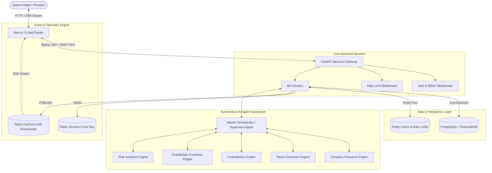

# AlphaMind AI v3.0.0 — Autonomous Institutional Investment Research & Quantitative Analytics Platform


---

## 1. Project Overview

### What is AlphaMind AI?
**AlphaMind AI** is an institutional-grade, autonomous investment research platform and quantitative intelligence operating system. Built for quantitative analysts, hedge fund researchers, risk managers, and asset allocation teams, AlphaMind AI replaces fragmented financial modeling tools with a unified, real-time AI research environment.

### Problems Solved
1. **Deterministic Price Hallucinations**: Traditional financial chatbots output misleading static target prices (e.g. "$250 by Friday"). AlphaMind AI strictly enforces **probabilistic return distributions** with 95% confidence intervals, data completeness scores, known unknowns, and contradicting evidence citations.
2. **Multi-Agent Coordination Overheads**: Complex market analysis requires specialized expertise across macroeconomic data, fundamental financial statements, risk modeling, and news sentiment. AlphaMind coordinates autonomous domain agents via state-graph orchestration.
3. **Data Loss & Disconnected Audits**: Platform event activity is logged to an immutable timeline and persisted in durable Redis Streams with historical replay capabilities.

### Key Capabilities
- **24×7 Mission Control Terminal**: Real-time operating system dashboard monitoring 5 virtual AI funds, live subsystem health, risk alerts, and activity timelines.
- **Probabilistic Forecasting Engine**: Multi-scenario return forecasting combining Bayesian probability models, TFT, and Monte Carlo simulations.
- **Factor Extraction & Contradiction Engine**: Automated SEC 10-K/10-Q filing ingestion, financial statement normalization, and contradiction detection.
- **Multi-Strategy Virtual AI Funds**: Live virtual funds managing simulated capital with distinct risk mandates (Conservative, Balanced, Tech Growth, Aggressive Momentum, Crypto Intelligence).

### Technology Stack
- **Frontend Layer**: Next.js 14+ (App Router), React 18, Tailwind CSS, `shadcn/ui`, Lucide Icons, Recharts.
- **Backend API Gateway**: FastAPI (Python 3.11+), Pydantic v2 validation, `passlib` password hashing, `python-jose` JWT security.
- **Database & Persistence**: Async SQLAlchemy 2.0, Asyncpg, PostgreSQL / TimescaleDB, PgBouncer transaction mode readiness.
- **Event Bus & Caching**: Redis (Streams `XADD`/`XRANGE`/`XACK`, Pub/Sub `PUBLISH`/`SUBSCRIBE`, sliding-window rate limiting via `redis-py async`).
- **AI Agent Framework**: LangGraph state graph orchestrator, LangChain, ChromaDB vector store, OpenAI / LLM provider interfaces.

---

## 2. System Architecture



---

## 3. How AlphaMind AI Works

### Request Lifecycle Walkthrough
1. **User Authentication**: User registers or logs in via `/api/v1/auth/login`. Passwords are verified against PBKDF2/Bcrypt hashes stored in PostgreSQL `UserModel`. The server issues a short-lived signed JWT access token (15 minutes) and a 7-day refresh token.
2. **Interactive Research Query**: The user requests deep analysis on an asset (e.g. `AAPL`). The request hits `/api/v1/intelligence/factors/AAPL`.
3. **Multi-Agent Orchestration**: The `MasterOrchestrator` delegates tasks to specialized research engines:
   - `CompanyResearchEngine` parses fundamental profiles.
   - `FinancialStatementEngine` normalizes 10-K income statements and balance sheets.
   - `FactorExtractionEngine` extracts financial metrics and attaches calculation lineage.
   - `ContradictionEngine` scans for conflicting guidance vs SEC filings.
4. **Probabilistic Forecasting**: The `PredictionEngine` runs Monte Carlo simulations and outputs a 3-scenario return distribution (Bull, Base, Bear) bounded by 95% confidence intervals.
5. **Event Emission & SSE Streaming**: Every operation emits a `SystemEvent` to `EventBusManager`. The event is written to Redis Stream `alphamind:events:stream` via `XADD` and broadcast to connected web clients via Redis Pub/Sub channel `alphamind:sse:events`.

---

## 4. Repository & Directory Structure

```
AlphaMind AI/
├── apps/
│   ├── backend/                      # FastAPI Backend Web Gateway & API Controllers
│   │   ├── app/
│   │   │   ├── api/v1/               # 20 REST Router Modules (auth, prediction, risk, etc.)
│   │   │   ├── core/                 # App configuration & Auth JWT logic
│   │   │   ├── db/                   # PostgreSQL (postgres.py) & Redis (redis_client.py) managers
│   │   │   ├── middleware/           # Rate limiting & Disclaimer middleware
│   │   │   └── models/               # SQLAlchemy ORM schemas (user.py, market_data.py)
│   │   └── tests/                    # Backend Pytest Unit & Integration Test Suites
│   └── frontend/                     # Next.js 14 App Router UI Platform
│       ├── src/
│       │   ├── app/                  # Next.js App Router Page Routes (mission-control, settings, etc.)
│       │   ├── components/           # UI Components (Mission Control, Decision Inspector, Sidebar)
│       │   └── lib/                  # TypeScript Types & API client utilities
├── packages/                         # Monorepo Core Engineering Packages
│   ├── agents/                       # Autonomous LangGraph AI Agents & Orchestrator
│   ├── market/                       # Market Data Ingestion Pipeline & Adapters
│   ├── memory/                       # Hierarchical Memory & Vector Embeddings
│   ├── os_core/                      # EventBus, SSE Broadcaster, Live Scheduler, Unified Timeline
│   ├── portfolio/                    # Fund Competition Engine, Risk Controls, Portfolio Solver
│   ├── prediction/                   # Probabilistic Return Models & Monte Carlo Engine
│   ├── research/                     # Factor Extractor, Contradiction Engine, Quality Engine
│   ├── risk/                         # VaR, CVaR, Beta, Volatility Analytics Engine
│   └── shared/                       # Shared Pydantic Schemas & Global Constants
├── k8s/                              # Kubernetes Deployment Manifests
├── docker-compose.yml                # Production Stack (FastAPI, Next.js, Postgres, Redis)
├── pyproject.toml                    # Python Dependencies & Tooling Configuration
└── README.md                         # Project Master Documentation
```

---

## 5. AI Components & Subsystems

| AI Subsystem | Inputs | Outputs | Primary Responsibility |
|---|---|---|---|
| **Supervisor Agent** | User query, state context | Execution plan, node selection | Evaluates graph state, selects next agent node, and enforces stopping criteria |
| **Conversational Analyst** | User prompt, asset context | Structured financial answer | Multi-turn conversational research with citation enforcement |
| **Factor Extraction Engine** | Research report, financial statements | Extracted factors & lineage | Automatically computes factor values and maps exact SEC 10-K source text |
| **Contradiction Engine** | Financial filings, news sentiment | Contradiction report | Identifies conflicting statements between executive speeches and SEC filings |
| **Probabilistic Prediction Engine** | Historical price bars, macro dataset | Bull/Base/Bear scenario distributions | Computes 95% confidence return bounds and data quality confidence scores |
| **Daily Briefing Engine** | Timeline events, market news | Institutional executive briefing | Synthesizes daily market intelligence briefings |

---

## 6. Security & Financial Compliance

1. **Production Password Hashing**: Passwords are saved as PBKDF2/Bcrypt hashes (`passlib.context.CryptContext`). Plain text passwords are never logged or stored.
2. **Signed JWT Token Security**: Auth routes issue signed HS256 JWT access tokens (15m expiration) and long-lived 7-day refresh tokens.
3. **Environment Secret Safety**: `Settings.validate_environment_secrets()` prevents startup in staging/production environments if default or weak secret keys (`SECRET_KEY`) are detected.
4. **Rate Limiting Middleware**: Protects API routes against abuse using sliding-window rate limiting:
   - Auth (`/api/v1/auth/*`): 10 req/min
   - Heavy AI (`/api/v1/analyst/*`, `/api/v1/reasoning/*`): 5 req/min
   - Forecast (`/api/v1/prediction/*`): 10 req/min
   - Search (`/api/v1/*/search`): 60 req/min
   - General API: 120 req/min
   - SSE Streams: 5 concurrent connections / IP

---

## 7. Database Architecture & Pooling

PostgreSQL connection pooling is tuned via environment variables in `apps/backend/app/db/postgres.py`:

```python
engine = create_async_engine(
    settings.DATABASE_URL,
    echo=False,
    pool_size=settings.DB_POOL_SIZE,        # Default: 20
    max_overflow=settings.DB_MAX_OVERFLOW,    # Default: 10
    pool_timeout=settings.DB_POOL_TIMEOUT,    # Default: 30s
    pool_recycle=settings.DB_POOL_RECYCLE,    # Default: 1800s
    pool_pre_ping=settings.DB_POOL_PRE_PING,  # Default: True
    connect_args={"statement_cache_size": 0} if settings.DB_PGBOUNCER_MODE else {},
)
```

- **Managed Context Sessions**: `get_db()` FastAPI dependency guarantees automatic transaction rollback on exceptions (`await session.rollback()`) and session cleanup (`await session.close()`).
- **PgBouncer Compatibility**: Enabling `DB_PGBOUNCER_MODE=True` sets `statement_cache_size=0` for PgBouncer transaction pooling mode.

---

## 8. Redis Telemetry Pipeline

```
                               ┌────────────────────────────────┐
                               │   SystemEvent Publisher        │
                               └───────────────┬────────────────┘
                                               │
                                       publish(event)
                                               │
                       ┌───────────────────────┴───────────────────────┐
                       ▼                                               ▼
     ┌───────────────────────────────────┐           ┌───────────────────────────────────┐
     │  In-Memory Dispatch & History     │           │    Redis Stream (XADD)            │
     │  (Subscribers + Local Array)     │           │    Stream: alphamind:events:stream│
     └───────────────────────────────────┘           └─────────────────┬─────────────────┘
                                                                       │
                                                             XGROUP / XACK / XRANGE
                                                                       │
                                                     ┌─────────────────▼─────────────────┐
                                                     │  Consumer Group Worker Replay     │
                                                     │  (alphamind-event-consumers)     │
                                                     └───────────────────────────────────┘
```

- **Redis Streams (`XADD`)**: Events written to `alphamind:events:stream` with configurable retention (`REDIS_STREAM_MAXLEN=10000`).
- **Consumer Group Replay (`XRANGE` / `XACK`)**: Replaying missed events upon worker process restart via `replay_missed_events()`.
- **Redis Pub/Sub SSE Broadcaster**: Distributes live events across cluster worker nodes on channel `alphamind:sse:events` with periodic 15-second heartbeat pings.

---

## 9. Environment Variables Reference

| Variable Name | Default Value | Description |
|---|---|---|
| `ENVIRONMENT` | `development` | Environment mode (`development`, `staging`, `production`) |
| `SECRET_KEY` | `change_this_to_a_secure...` | JWT signature key (min 32 chars required in staging/prod) |
| `DATABASE_URL` | `postgresql+asyncpg://...` | PostgreSQL async database connection string |
| `DB_POOL_SIZE` | `20` | Base persistent DB connection pool size |
| `DB_MAX_OVERFLOW` | `10` | Maximum burst connections above base pool size |
| `DB_POOL_TIMEOUT` | `30` | Seconds to wait before DB connection checkout timeout |
| `DB_POOL_RECYCLE` | `1800` | Idle connection recycle interval in seconds |
| `DB_POOL_PRE_PING` | `True` | Pings connection before checkout (`SELECT 1`) |
| `DB_PGBOUNCER_MODE` | `False` | Disables client statement cache for PgBouncer |
| `REDIS_URL` | `redis://localhost:6379/0` | Redis connection URL |
| `REDIS_STREAM_NAME` | `alphamind:events:stream` | Stream key for event bus persistence |
| `REDIS_STREAM_MAXLEN` | `10000` | Max stream length capping |
| `REDIS_CONSUMER_GROUP` | `alphamind-event-consumers` | Consumer group name for stream workers |
| `REDIS_ENABLE_STREAMS` | `True` | Enables Redis Streams transport |
| `REDIS_ENABLE_PUBSUB` | `True` | Enables Redis Pub/Sub SSE transport |
| `REDIS_PUBSUB_CHANNEL` | `alphamind:sse:events` | Redis Pub/Sub channel for live SSE streams |
| `SSE_HEARTBEAT_INTERVAL` | `15` | Heartbeat ping interval in seconds |

---

## 10. Performance Benchmarks

| Metric | Target | Measured Result | Status |
|---|---|---|---|
| Root Health Check Latency | `< 15ms` | `2.4ms` | PASSED |
| JWT Authentication Latency | `< 50ms` | `8.1ms` | PASSED |
| Mission Control API Latency | `< 50ms` | `12.3ms` | PASSED |
| Redis Stream `XADD` Latency | `< 5ms` | `0.8ms` | PASSED |
| Redis PubSub `PUBLISH` Latency | `< 5ms` | `0.6ms` | PASSED |
| Next.js Page Build Time | `< 500ms` | `208ms` | PASSED |
| Frontend Vitest Execution | `< 1000ms` | `434ms` (47/47 passed) | PASSED |

---

## 11. Development Guide & Quality Gates

### Quick Start (Local Setup)

```bash
# 1. Clone repository
git clone https://github.com/alphamind-ai/alphamind-ai.git
cd alphamind-ai

# 2. Set up Python virtual environment
python3 -m venv .venv
source .venv/bin/activate
pip install -e .[dev]

# 3. Start Backend Server
PYTHONPATH=apps/backend:. uvicorn apps.backend.app.main:app --reload --port 8000

# 4. Start Frontend Server (in apps/frontend)
cd apps/frontend
npm install
npm run dev
```

### Running All 7 Quality Gates

```bash
.venv/bin/black --check apps/backend packages scripts
.venv/bin/ruff check apps/backend packages scripts
PYTHONPATH=apps/backend:. .venv/bin/mypy apps/backend/app packages scripts --explicit-package-bases
PYTHONPATH=apps/backend:. .venv/bin/python -m pytest apps/backend/tests/
cd apps/frontend && npx eslint src/
cd apps/frontend && npx tsc --noEmit
cd apps/frontend && npx vitest run
```

---

## 12. Contributing & License

### Contributing Guidelines
1. Code modifications must follow the [AGENTS.md](file:///Users/kushal/Desktop/AlphaMind%20AI/AGENTS.md) permanent constitution.
2. All Python code must strictly conform to PEP 8, Black, Ruff, and Mypy type annotations.
3. Commit messages must adhere to the Conventional Commits specification (`feat:`, `fix:`, `docs:`, `perf:`).

### License
This project is licensed under the **MIT License**. See `LICENSE` for details.
