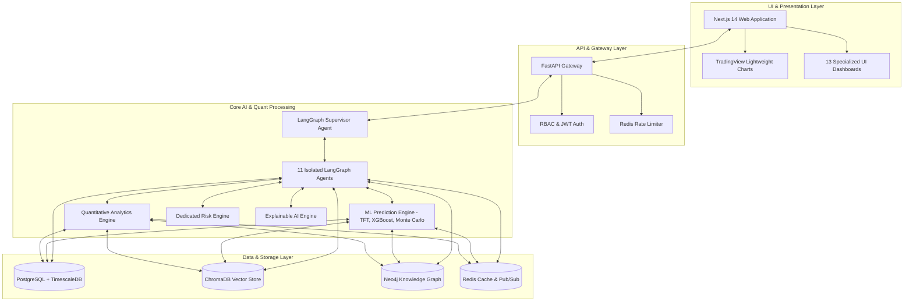

# Document 01: System Master Overview (README)

## Purpose
This document serves as the master entrypoint to the **AlphaMind AI** technical documentation suite, outlining the core product vision, system principles, and architectural layout for engineering, quantitative research, and DevOps teams.

## Responsibilities
- Define the operational mission and probability-based forecasting philosophy.
- Provide a high-level component map of the monorepo architecture.
- Document system dependencies, multi-asset data flows, and security constraints.
- Maintain references to all sub-system design documents.

## High-Level System Architecture

## Core Architectural Guarantees
1. **Zero-Fact Prediction Guarantee**: No prediction is ever returned as a single-point price target or deterministic guarantee. Every prediction includes a 95% confidence interval, probability distribution, known unknowns, and contradicting evidence.
2. **Strict Agent Topology**: Agents communicate **strictly and exclusively** through the shared `LangGraph State`. Direct agent-to-agent method invocations are prohibited.
3. **Multi-Provider Data Redundancy**: Automatic 3-tier provider failover (`Polygon.io` $\rightarrow$ `Alpha Vantage` $\rightarrow$ `yfinance`) with continuous health checks and circuit breakers.
4. **Institutional Compliance**: Mandatory financial disclaimers appended to all generated research reports and research API responses.

## Dependencies & External Systems
- **Python 3.11+**, **Node.js 18+**, **Docker & Docker Compose**.
- **PostgreSQL 16** with `TimescaleDB` extension.
- **ChromaDB 0.4+** vector database.
- **Neo4j 5+** graph database.
- **Redis 7+** cache and message broker.

## Documentation Index
- [02. Project Roadmap](file:///Users/kushal/Desktop/AlphaMind%20AI/docs/02_PROJECT_ROADMAP.md)
- [03. System Architecture](file:///Users/kushal/Desktop/AlphaMind%20AI/docs/03_SYSTEM_ARCHITECTURE.md)
- [04. Database Design](file:///Users/kushal/Desktop/AlphaMind%20AI/docs/04_DATABASE_DESIGN.md)
- [05. API Design](file:///Users/kushal/Desktop/AlphaMind%20AI/docs/05_API_DESIGN.md)
- [06. Agent Architecture](file:///Users/kushal/Desktop/AlphaMind%20AI/docs/06_AGENT_ARCHITECTURE.md)
- [07. UI/UX Plan](file:///Users/kushal/Desktop/AlphaMind%20AI/docs/07_UI_UX_PLAN.md)
- [08. Development Plan](file:///Users/kushal/Desktop/AlphaMind%20AI/docs/08_DEVELOPMENT_PLAN.md)
- [09. Feature Roadmap](file:///Users/kushal/Desktop/AlphaMind%20AI/docs/09_FEATURE_ROADMAP.md)
- [10. Testing Strategy](file:///Users/kushal/Desktop/AlphaMind%20AI/docs/10_TESTING_STRATEGY.md)
- [11. Security Architecture](file:///Users/kushal/Desktop/AlphaMind%20AI/docs/11_SECURITY_ARCHITECTURE.md)
- [12. Observability & Telemetry](file:///Users/kushal/Desktop/AlphaMind%20AI/docs/12_OBSERVABILITY.md)
- [13. Data Pipeline](file:///Users/kushal/Desktop/AlphaMind%20AI/docs/13_DATA_PIPELINE.md)
- [14. Model Registry](file:///Users/kushal/Desktop/AlphaMind%20AI/docs/14_MODEL_REGISTRY.md)
- [15. Knowledge Graph](file:///Users/kushal/Desktop/AlphaMind%20AI/docs/15_KNOWLEDGE_GRAPH.md)
- [16. Risk Engine](file:///Users/kushal/Desktop/AlphaMind%20AI/docs/16_RISK_ENGINE.md)
- [17. Prediction Engine](file:///Users/kushal/Desktop/AlphaMind%20AI/docs/17_PREDICTION_ENGINE.md)
- [18. Memory System](file:///Users/kushal/Desktop/AlphaMind%20AI/docs/18_MEMORY_SYSTEM.md)
- [19. Coding Standards](file:///Users/kushal/Desktop/AlphaMind%20AI/docs/19_CODING_STANDARDS.md)
- [20. TODO Checklist](file:///Users/kushal/Desktop/AlphaMind%20AI/docs/20_TODO.md)
- [System Boundaries](file:///Users/kushal/Desktop/AlphaMind%20AI/docs/SYSTEM_BOUNDARIES.md)
- [Repository Constitution (AGENTS.md)](file:///Users/kushal/Desktop/AlphaMind%20AI/AGENTS.md)
- [Architecture Decision Records (ADRs)](file:///Users/kushal/Desktop/AlphaMind%20AI/docs/adr)

## Future Expansion
Future expansion includes real-time voice-driven agent interaction, options volatility skew surface modeling, order routing to crypto decentralized liquidity pools, and federated model training on institutional dark pool data.
