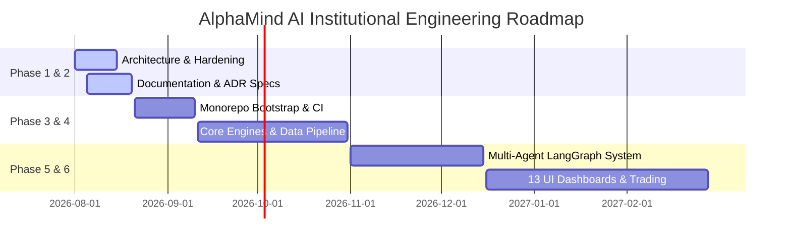

# Document 02: Project Roadmap

## Purpose
The **PROJECT_ROADMAP.md** defines the multi-year, 6-phase engineering trajectory for AlphaMind AI, transitioning the platform from architectural blueprint to an institutional-grade, multi-asset quantitative research and trading system.

## Responsibilities
- Establish clear milestone gates and release criteria for each development phase.
- Map core feature delivery across backend engines, LangGraph agents, frontend dashboards, and infrastructure layers.
- Align technical milestones with quantitative risk and compliance requirements.

## 6-Phase Engineering Delivery Roadmap

### Phase 1: Vision & Master Architectural Strategy (Completed)
- Define domain boundaries, multi-asset data engine requirements, probability-based forecasting philosophy, and initial monorepo layout.
- Establish `AGENTS.md` engineering constitution and `SYSTEM_BOUNDARIES.md`.

### Phase 2: Design Hardening & Documentation (Current Phase)
- Generate 20 comprehensive technical architecture documents and 10 Architecture Decision Records (ADRs).
- Define 3-tier provider failover matrices, prediction safety schemas, dedicated risk engine specs, circuit breaker logic, model registry, evaluation metrics, and 13 UI dashboard specs.

### Phase 3: Monorepo Bootstrap & Infrastructure Setup
- Scaffold `apps/backend` (FastAPI), `apps/frontend` (Next.js 14), `packages/agents`, `packages/research`, `packages/prediction`, `packages/portfolio`, `packages/shared`.
- Setup Docker Compose infrastructure (PostgreSQL 16 + TimescaleDB, ChromaDB, Neo4j, Redis, Prometheus, Grafana).
- Implement CI/CD automated linting (`black`, `ruff`, `mypy`, `tsc`), PyTest runner, and Jest test runner.

### Phase 4: Core Data Pipeline, Quant Engine & Model Registry
- Implement 9-stage data ingestion pipeline (`Polygon.io`, `FRED`, `CCXT`, `yfinance`, `SEC EDGAR`).
- Build Quantitative Analytics Engine (CAPM, Fama-French 3/5 factor models, cointegration & pairs trading, risk metrics VaR/CVaR).
- Build Multi-LLM Model Registry and ML Prediction Engine (Temporal Fusion Transformers, XGBoost, CatBoost, 10,000-run Monte Carlo simulations).
- Construct Neo4j Financial Knowledge Graph schema and ingestion loaders.

### Phase 5: Multi-Agent LangGraph Engine & Memory Systems
- Implement 11 specialized autonomous agents and Supervisor orchestration graph.
- Implement Hierarchical Memory System (Working, Episodic, Semantic, Investment Journal) with rolling Brier Score self-calibration.
- Implement Dedicated Risk Engine, AI Hallucination verification, and Agent Circuit Breakers.
- Build Explainable AI (XAI) engine generating SHAP feature attributions and bull/bear argument matrices.

### Phase 6: 13 Interactive UI Dashboards & Paper Trading
- Implement 13 Next.js UI dashboards with `shadcn/ui` components and TradingView Lightweight Charts.
- Build real-time Server-Sent Events (SSE) agent execution log stream UI.
- Implement Paper Trading simulated execution engine and backtesting visualizer.
- Perform end-to-end security penetration testing, RBAC verification, and financial disclaimer compliance audit.

## Dependencies
- Completion of Milestone 2 architecture approval prior to Phase 3 monorepo bootstrapping.
- API Key provisioning for data providers (`Polygon.io`, `FRED`) and LLM providers (`OpenAI`, `Anthropic`).

## References to Other Documents
- [01. README](file:///Users/kushal/Desktop/AlphaMind%20AI/docs/01_README.md)
- [03. System Architecture](file:///Users/kushal/Desktop/AlphaMind%20AI/docs/03_SYSTEM_ARCHITECTURE.md)
- [08. Development Plan](file:///Users/kushal/Desktop/AlphaMind%20AI/docs/08_DEVELOPMENT_PLAN.md)
- [20. TODO Checklist](file:///Users/kushal/Desktop/AlphaMind%20AI/docs/20_TODO.md)
