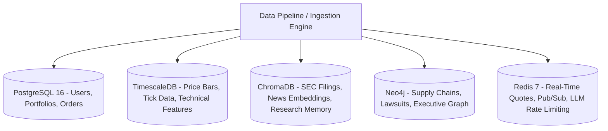

# Document 04: Database & Storage Engine Design

## Purpose
The **DATABASE_DESIGN.md** document specifies the multi-database storage architecture for AlphaMind AI, combining relational tables, time-series hyper-tables, vector collections, graph nodes, and in-memory caches.

## Responsibilities
- Schema definition for PostgreSQL 16 relational data and TimescaleDB time-series price bars.
- Vector collection schema for ChromaDB document embeddings and SEC filings.
- Graph model schema for Neo4j Financial Knowledge Graph nodes and edges.
- Redis key structure for caching, rate limiting, and WebSockets/SSE pub-sub streaming.

## Multi-Database Storage Paradigm

---

## 1. PostgreSQL 16 & TimescaleDB Relational Schemas

### Core Relational Tables
- `users`: `id (UUID)`, `email (VARCHAR)`, `password_hash (VARCHAR)`, `role (ENUM)`, `created_at (TIMESTAMPTZ)`.
- `portfolios`: `id (UUID)`, `user_id (UUID FK)`, `name (VARCHAR)`, `cash_balance (NUMERIC)`, `currency (VARCHAR)`.
- `positions`: `id (UUID)`, `portfolio_id (UUID FK)`, `symbol (VARCHAR)`, `asset_class (VARCHAR)`, `quantity (NUMERIC)`, `avg_entry_price (NUMERIC)`.
- `paper_orders`: `id (UUID)`, `portfolio_id (UUID FK)`, `symbol (VARCHAR)`, `side (ENUM)`, `order_type (ENUM)`, `quantity (NUMERIC)`, `limit_price (NUMERIC)`, `status (ENUM)`.
- `investment_journal`: `id (UUID)`, `asset_symbol (VARCHAR)`, `forecast_date (TIMESTAMPTZ)`, `predicted_bull_pct (FLOAT)`, `predicted_base_pct (FLOAT)`, `predicted_bear_pct (FLOAT)`, `actual_outcome_pct (FLOAT)`, `brier_score (FLOAT)`.

### TimescaleDB Time-Series Hyper-Tables
- `market_bars_daily`: Hyper-table partitioned by `time` (daily) and indexed on `(symbol, time DESC)`.
  - Columns: `time (TIMESTAMPTZ)`, `symbol (VARCHAR)`, `asset_class (VARCHAR)`, `open (FLOAT)`, `high (FLOAT)`, `low (FLOAT)`, `close (FLOAT)`, `volume (BIGINT)`, `vwap (FLOAT)`.
- `technical_indicators_daily`: Hyper-table storing pre-computed technical indicators (`rsi_14`, `macd_12_26`, `bollinger_upper`, `bollinger_lower`, `atr_14`).

---

## 2. ChromaDB Vector Store Schema

### Collections
1. `sec_filings_collection`:
   - Metadata: `{"ticker": "AAPL", "form_type": "10-K", "fiscal_year": 2025, "section": "Item 1A Risk Factors"}`
   - Embedding: OpenAI `text-embedding-3-large` (3072 dimensions) or BGE-Large.
   - Distance Metric: Cosine Similarity.
2. `news_articles_collection`:
   - Metadata: `{"title": "...", "publisher": "Reuters", "published_timestamp": "...", "sentiment_score": 0.72}`
3. `research_memory_collection`:
   - Metadata: `{"agent_id": "CompanyResearchAgent", "query_symbol": "NVDA", "session_id": "..."}`

---

## 3. Neo4j Financial Knowledge Graph Model

### Node Labels
- `:Company {symbol: String, name: String, market_cap: Float, sector: String}`
- `:Executive {name: String, title: String, age: Integer}`
- `:Product {name: String, category: String}`
- `:Industry {name: String}`
- `:Country {iso_code: String, name: String}`
- `:MacroEvent {name: String, date: Date, impact_score: Float}`

### Edge Relationships
- `(:Company)-[:SUPPLIES_TO {volume_pct: Float}]->(:Company)`
- `(:Company)-[:COMPETES_WITH]->(:Company)`
- `(:Executive)-[:EXECUTIVE_AT {role: String}]->(:Company)`
- `(:Company)-[:IMPACTED_BY]->(:MacroEvent)`

---

## 4. Redis Key Structure & TTL Matrix

- `quote:{symbol}` $\rightarrow$ Hash storing latest tick data (TTL: 60s).
- `rate_limit:{user_id}` $\rightarrow$ String tracking request count for API rate limiting (TTL: 60s).
- `agent_state:{session_id}` $\rightarrow$ JSON string storing transient LangGraph State (TTL: 1 hour).
- `pubsub:agent_logs:{session_id}` $\rightarrow$ Redis Pub/Sub channel for Server-Sent Events UI streaming.

## Dependencies & Sub-System References
- [03. System Architecture](file:///Users/kushal/Desktop/AlphaMind%20AI/docs/03_SYSTEM_ARCHITECTURE.md)
- [05. API Design](file:///Users/kushal/Desktop/AlphaMind%20AI/docs/05_API_DESIGN.md)
- [15. Knowledge Graph](file:///Users/kushal/Desktop/AlphaMind%20AI/docs/15_KNOWLEDGE_GRAPH.md)
- [18. Memory System](file:///Users/kushal/Desktop/AlphaMind%20AI/docs/18_MEMORY_SYSTEM.md)
