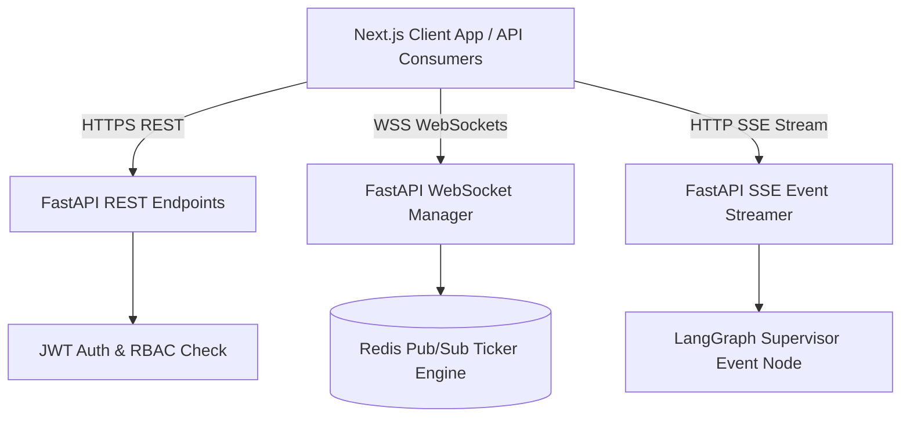

# Document 05: REST, WebSockets & Server-Sent Events (SSE) API Design

## Purpose
The **API_DESIGN.md** document details the complete OpenAPI 3.0 REST specification, real-time WebSocket protocol streams, and Server-Sent Events (SSE) agent log execution endpoints for AlphaMind AI.

## Responsibilities
- Define REST endpoints for user auth, asset search, quant analytics, portfolio management, backtesting, and paper trading.
- Specify real-time WebSocket formats for streaming multi-asset tick updates and chart candles.
- Define SSE event streaming protocol for real-time agent reasoning steps and XAI research generation.

## API Architecture & Gateway Topology



---

## 1. REST Endpoints Specification (OpenAPI 3.0)

### Auth & User Endpoints
- `POST /api/v1/auth/register` - Create new user account.
- `POST /api/v1/auth/login` - Authenticate & receive JWT access + refresh tokens.
- `GET /api/v1/auth/me` - Fetch authenticated user profile & RBAC permissions.

### Market Data & Quant Endpoints
- `GET /api/v1/market/search?query={q}` - Multi-asset search (Equities, ETFs, Crypto, FX, Futures).
- `GET /api/v1/market/bars/{symbol}?timeframe=1D&start={s}&end={e}` - Fetch OHLCV price bars.
- `GET /api/v1/quant/factors/{symbol}` - Fetch CAPM & Fama-French 3/5 factor regression outputs.
- `GET /api/v1/quant/pairs?asset1={a1}&asset2={a2}` - Calculate cointegration, Hurst exponent, and mean-reversion metrics.

### Multi-Agent Research & Prediction Endpoints
- `POST /api/v1/research/analyze` - Trigger multi-agent research workflow.
  - Body: `{"symbol": "NVDA", "horizon_days": 30, "include_sec": true, "include_kg": true}`
- `GET /api/v1/research/reports/{report_id}` - Fetch generated Explainable AI research report.
- `POST /api/v1/prediction/simulate` - Execute 10,000-run Monte Carlo simulation for an asset.

### Portfolio & Paper Trading Endpoints
- `GET /api/v1/portfolio` - Get user portfolio balances, holdings, and risk metrics (VaR, CVaR).
- `POST /api/v1/portfolio/optimize` - Run portfolio optimization (Mean-Variance, Black-Litterman, HRP).
- `POST /api/v1/trading/orders` - Submit paper trading order (Market, Limit, Stop-Loss).
- `GET /api/v1/backtest/run` - Trigger VectorBT strategy backtest.

---

## 2. Real-Time WebSockets Protocol (`/ws/v1/stream`)

### Client Subscribe Message
```json
{
  "action": "subscribe",
  "topic": "ticks",
  "symbols": ["AAPL", "BTC/USD", "EUR/USD", "ES=F"]
}
```

### Server Tick Event Message
```json
{
  "topic": "ticks",
  "symbol": "AAPL",
  "price": 224.50,
  "change_pct": 1.25,
  "volume": 421500,
  "timestamp": "2026-08-04T18:32:00Z"
}
```

---

## 3. Server-Sent Events (SSE) Protocol (`/api/v1/research/stream/{session_id}`)

Real-time streaming of agent execution steps to the UI:

```http
HTTP/1.1 200 OK
Content-Type: text/event-stream
Cache-Control: no-cache
Connection: keep-alive

event: agent_start
data: {"agent": "SECStatementAgent", "task": "Extracting Item 1A Risk Factors from NVDA 10-K"}

event: agent_step
data: {"agent": "SECStatementAgent", "status": "Found 4 regulatory risk points", "confidence": 0.91}

event: agent_complete
data: {"agent": "SECStatementAgent", "output_keys": ["sec_risks_summary"]}

event: research_finalized
data: {"report_id": "rep_9482751", "xai_confidence_score": 0.84}
```

## Dependencies & Sub-System References
- [03. System Architecture](file:///Users/kushal/Desktop/AlphaMind%20AI/docs/03_SYSTEM_ARCHITECTURE.md)
- [04. Database Design](file:///Users/kushal/Desktop/AlphaMind%20AI/docs/04_DATABASE_DESIGN.md)
- [06. Agent Architecture](file:///Users/kushal/Desktop/AlphaMind%20AI/docs/06_AGENT_ARCHITECTURE.md)
- [11. Security Architecture](file:///Users/kushal/Desktop/AlphaMind%20AI/docs/11_SECURITY_ARCHITECTURE.md)
