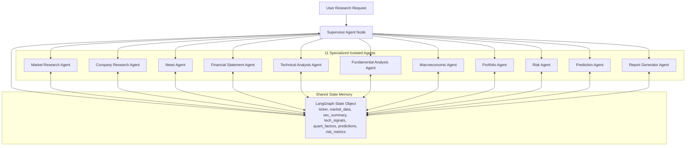

# Document 06: LangGraph Multi-Agent Architecture & Topology

## Purpose
The **AGENT_ARCHITECTURE.md** document specifies the 11 specialized autonomous AI agents, their LangGraph state graph definitions, Supervisor orchestration, prompt structures, tool bindings, recovery circuit breakers, and zero-direct-call isolation rules.

## Responsibilities
- Detail the responsibilities, tool bindings, and prompt constraints for all 11 AI agents.
- Specify the shared `LangGraph State` schema.
- Define Supervisor control logic and dynamic graph node transition rules.
- Enforce circuit breakers, fallback model handlers, and human review flags.

## Master LangGraph Topology & State Flow



---

## Shared LangGraph State Schema (`AlphaMindAgentState`)

Defined in Python using Pydantic v2 / `TypedDict`:

```python
class AlphaMindAgentState(TypedDict):
    session_id: str
    symbol: str
    asset_class: str
    target_horizon_days: int
    user_id: str
    
    # Data payloads added by agents
    market_data: Optional[Dict[str, Any]]
    sec_filings_data: Optional[Dict[str, Any]]
    news_sentiment_data: Optional[Dict[str, Any]]
    technical_indicators: Optional[Dict[str, Any]]
    fundamental_metrics: Optional[Dict[str, Any]]
    macro_indicators: Optional[Dict[str, Any]]
    knowledge_graph_subgraph: Optional[Dict[str, Any]]
    
    # Quantitative & ML Outputs
    quant_factor_outputs: Optional[Dict[str, Any]]
    ml_forecast_distribution: Optional[Dict[str, Any]]
    monte_carlo_results: Optional[Dict[str, Any]]
    risk_assessment: Optional[Dict[str, Any]]
    
    # Final Output
    final_report_json: Optional[Dict[str, Any]]
    
    # Control Plane Metadata
    completed_agent_nodes: List[str]
    current_node: str
    circuit_breaker_active: bool
    error_logs: List[Dict[str, Any]]
```

---

## Detailed Specifications for 11 Specialized AI Agents

### 1. Market Research Agent (`MarketResearchAgent`)
- **Responsibility**: Ingest real-time and historic daily/intraday prices, volume, and volatility across multi-asset providers (`Polygon.io`, `CCXT`, `yfinance`).
- **Tools**: `get_price_history()`, `get_asset_profile()`, `get_options_chain()`.

### 2. Company Research Agent (`CompanyResearchAgent`)
- **Responsibility**: Fetch corporate structure, business model details, executive leadership, and segment revenue breakdowns.
- **Tools**: `get_company_profile()`, `query_knowledge_graph()`.

### 3. News Analysis Agent (`NewsAgent`)
- **Responsibility**: Ingest recent news media, compute FinBERT sentiment polarity scores, identify emerging topic clusters, and flag high-impact news events.
- **Tools**: `search_financial_news()`, `compute_finbert_sentiment()`.

### 4. Financial Statement Agent (`FinancialStatementAgent`)
- **Responsibility**: Extract 10-K / 10-Q SEC XBRL financial statements, parse Item 1A Risk Factors, and compute financial health metrics (Altman Z-Score, Beneish M-Score).
- **Tools**: `query_sec_edgar()`, `vector_search_sec_filings()`.

### 5. Technical Analysis Agent (`TechnicalAnalysisAgent`)
- **Responsibility**: Calculate momentum (RSI, MACD), trend (SMA, EMA, Supertrend), volatility (ATR, Bollinger Bands), and volume indicators via `pandas-ta`.
- **Tools**: `compute_technical_indicators()`, `detect_chart_patterns()`.

### 6. Fundamental Analysis Agent (`FundamentalAnalysisAgent`)
- **Responsibility**: Compute valuation metrics (P/E, P/B, EV/EBITDA, P/FCF), profitability metrics (ROIC, ROE, Gross Margin), and DCF valuation ranges.
- **Tools**: `compute_valuation_ratios()`, `run_dcf_model()`.

### 7. Macroeconomic Agent (`MacroeconomicAgent`)
- **Responsibility**: Analyze Fed/RBI policy interest rate futures, inflation metrics (CPI, PPI), yield curve spreads (10Y-2Y), and ISM PMIs via FRED API.
- **Tools**: `get_fred_series()`, `get_economic_calendar()`.

### 8. Portfolio Agent (`PortfolioAgent`)
- **Responsibility**: Compute current asset allocation, asset contribution to risk, portfolio correlation matrix, and suggest optimal weight rebalancing (Markowitz, Black-Litterman, HRP).
- **Tools**: `optimize_portfolio()`, `get_portfolio_holdings()`.

### 9. Risk Agent (`RiskAgent`)
- **Responsibility**: Compute Value at Risk (VaR 95/99), Conditional VaR (CVaR), Beta, Stress Testing under Black Swan scenarios, and run **AI Hallucination Verification** against source PostgreSQL tables.
- **Tools**: `compute_var_cvar()`, `run_stress_test()`, `verify_hallucinations()`.

### 10. Prediction Agent (`PredictionAgent`)
- **Responsibility**: Run multi-model ensembles (Temporal Fusion Transformer, XGBoost, CatBoost, Bayesian inference) and execute 10,000-run Monte Carlo simulations to produce probability distribution forecasts.
- **Tools**: `run_tft_forecast()`, `run_xgboost_model()`, `run_monte_carlo_simulation()`.

### 11. Report Generator Agent (`ReportGeneratorAgent`)
- **Responsibility**: Synthesize all agent state findings into a structured Explainable AI (XAI) investment report with SHAP attributions, bull/bear argument matrices, confidence intervals, and mandatory SEC/FINRA disclaimers.
- **Tools**: `format_xai_report()`, `inject_compliance_disclaimer()`.

---

## Agent Failure Recovery & Circuit Breakers

```
Agent Node Execution Error / Timeout (> 10s)
  ├── 1. Exponential Backoff Retry (Max 3 attempts)
  ├── 2. Fallback Model Swapping (e.g. GPT-4o -> Claude 3.5 Sonnet)
  ├── 3. Circuit Breaker Trigger (Log error to state, flag partial response)
  └── 4. Supervisor Agent Reroutes Workflow to next viable node
```

## Dependencies & Sub-System References
- [03. System Architecture](file:///Users/kushal/Desktop/AlphaMind%20AI/docs/03_SYSTEM_ARCHITECTURE.md)
- [05. API Design](file:///Users/kushal/Desktop/AlphaMind%20AI/docs/05_API_DESIGN.md)
- [14. Model Registry](file:///Users/kushal/Desktop/AlphaMind%20AI/docs/14_MODEL_REGISTRY.md)
- [17. Prediction Engine](file:///Users/kushal/Desktop/AlphaMind%20AI/docs/17_PREDICTION_ENGINE.md)
