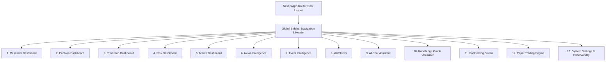

# Document 07: UI/UX Plan & 13 Interactive Dashboard Layouts

## Purpose
The **UI_UX_PLAN.md** document specifies the frontend user experience, page routing hierarchy, dark-mode design token system, TradingView Lightweight Charts integration, and component specifications for all 13 specialized dashboard modules in Next.js 14.

## Responsibilities
- Define Next.js 14 App Router layout structure and page navigation hierarchy.
- Establish visual design system (Typography, Dark-mode HSL color palette, Glassmorphic UI elements, Micro-animations).
- Detail layout specifications for all 13 interactive dashboards.
- Specify real-time agent execution log streaming component and TradingView chart integration.

## UI Page Layout Hierarchy

---

## Visual Design System & Tokens

### Color Palette (TailwindCSS / HSL Dark Mode)
- **Background Root**: `hsl(224, 71%, 4%)` (#030712 - Obsidian Dark)
- **Card / Surface**: `hsl(222, 47%, 11%)` (#0f172a - Slate Dark)
- **Primary Accent**: `hsl(217, 91%, 60%)` (#3b82f6 - Royal Financial Blue)
- **Secondary Accent**: `hsl(263, 70%, 50%)` (#8b5cf6 - Electric Violet)
- **Success / Bull**: `hsl(142, 71%, 45%)` (#22c55e - Emerald Green)
- **Danger / Bear**: `hsl(0, 84%, 60%)` (#ef4444 - Crimson Red)
- **Warning / Neutral**: `hsl(38, 92%, 50%)` (#f59e0b - Amber Gold)

### Typography
- Body & UI: `Inter` / `Outfit` (Google Fonts).
- Numeric Data & Code: `JetBrains Mono` (Monospaced alignment for financial tickers and math formulas).

---

## 13 Specialized Dashboard Specifications

1. **Research Dashboard (`/research`)**:
   - Universal multi-asset search header, real-time ticker quotes, company overview summary, key financial ratios table, technical indicator status badge grid.
2. **Portfolio Dashboard (`/portfolio`)**:
   - Total equity curve, asset allocation pie/donut chart, position table with unrealized PnL, asset contribution to portfolio risk gauge.
3. **Prediction Dashboard (`/prediction`)**:
   - Probability distribution curve chart (Bull/Base/Bear scenarios), 95% confidence interval range slider, 10,000-run Monte Carlo fan chart, Brier score accuracy overlay.
4. **Risk Dashboard (`/risk`)**:
   - VaR (95/99) gauge meter, CVaR risk meter, sector concentration heatmap, stress test macro scenario simulator sliders (e.g. "+200bps Fed rate spike").
5. **Macro Dashboard (`/macro`)**:
   - Dynamic 10Y-2Y yield curve chart, CPI/PPI inflation time series, FOMC rate hike probability bar chart, global macroeconomic release calendar.
6. **News Intelligence Dashboard (`/news`)**:
   - Live streaming news feed, FinBERT sentiment polarity pill badges (Positive/Neutral/Negative), NLP keyword topic cloud, high-impact news alert banners.
7. **Event Intelligence Dashboard (`/events`)**:
   - Corporate earnings release calendar, dividend payout schedule, Form 13F institutional smart money tracking, insider trading buy/sell table.
8. **Watchlists Dashboard (`/watchlists`)**:
   - Custom asset watchlist tables, drag-and-drop column sorting, custom price/RSI threshold alert trigger modal.
9. **AI Chat Assistant Dashboard (`/chat`)**:
   - Conversational AI research prompt bar, real-time Server-Sent Events (SSE) agent execution step drawer, Markdown XAI report renderer with embedded TradingView charts.
10. **Knowledge Graph Visualizer (`/knowledge-graph`)**:
    - Interactive 2D/3D force-directed node-link graph (canvas/WebGL), company supply chain dependency pathways, lawsuit & patent linkage inspector modal.
11. **Backtesting Studio (`/backtesting`)**:
    - VectorBT strategy parameter controls, historical equity curve comparison, trade log table, drawdown waterfall chart, Sharpe/Sortino/MaxDD metrics summary.
12. **Paper Trading Engine (`/paper-trading`)**:
    - Simulated order entry ticket (Market, Limit, Stop-Loss), live order execution blotter, active positions manager, execution slippage setting toggle.
13. **System Settings & Observability (`/settings`)**:
    - Data provider status health grid, API Key manager (Vault backend), Multi-LLM provider selector toggle, live LLM token cost expenditure analytics chart.

---

## TradingView Lightweight Charts Component Integration

Integrated via React wrapper hook (`useTradingViewChart`):
- Features: Candlestick price chart, Volume histogram, Moving Averages (50/200 SMA), RSI panel, MACD panel.
- Theme: Dark obsidian matching `hsl(224, 71%, 4%)`.
- Dynamic Resolution Switcher: 1m, 5m, 15m, 1h, 1D, 1W.

## Dependencies & Sub-System References
- [03. System Architecture](file:///Users/kushal/Desktop/AlphaMind%20AI/docs/03_SYSTEM_ARCHITECTURE.md)
- [05. API Design](file:///Users/kushal/Desktop/AlphaMind%20AI/docs/05_API_DESIGN.md)
- [06. Agent Architecture](file:///Users/kushal/Desktop/AlphaMind%20AI/docs/06_AGENT_ARCHITECTURE.md)
- [15. Knowledge Graph](file:///Users/kushal/Desktop/AlphaMind%20AI/docs/15_KNOWLEDGE_GRAPH.md)
