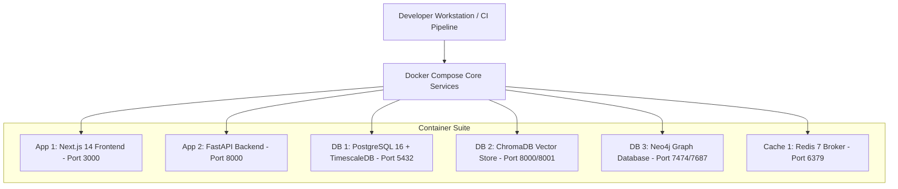

# Document 08: Development Plan & Infrastructure Setup

## Purpose
The **DEVELOPMENT_PLAN.md** document outlines the developer environment setup, local toolchains, Docker orchestration, environment configuration, CI/CD pipeline automation, and release verification protocols for AlphaMind AI.

## Responsibilities
- Define developer workstation prerequisites (Python 3.11+, Node 18+, Docker, Poetry/pip).
- Specify `docker-compose.yml` multi-container architecture.
- Detail local configuration environment variables (`.env.example`).
- Outline CI/CD GitHub Actions workflows for testing, linting, and container builds.

## Infrastructure & Local Developer Container Topology



---

## 1. Local Developer Workstation Setup

### Prerequisites
- Operating System: macOS (ARM/Intel), Linux (Ubuntu 22.04+), Windows WSL2.
- Runtimes: Python 3.11+, Node.js v18 LTS+, Docker Desktop 4.25+.

### Initial Setup Steps
```bash
# Clone repository
git clone https://github.com/alphamind-ai/alphamind-ai.git
cd alphamind-ai

# Copy environment template
cp .env.example .env

# Start local infrastructure stack
docker-compose up -d postgres redis chromadb neo4j

# Install Python backend dependencies
cd apps/backend
python3 -m venv .venv
source .venv/bin/activate
pip install -r requirements.txt

# Install Next.js frontend dependencies
cd ../frontend
npm install
```

---

## 2. Environment Configuration Matrix (`.env.example`)

```ini
# Application Core
ENVIRONMENT=development
LOG_LEVEL=DEBUG
SECRET_KEY=change_this_to_a_secure_256bit_random_secret_in_production
ALLOWED_ORIGINS=http://localhost:3000

# PostgreSQL + TimescaleDB
POSTGRES_USER=alphamind
POSTGRES_PASSWORD=alphamind_dev_pass
POSTGRES_DB=alphamind_db
POSTGRES_HOST=localhost
POSTGRES_PORT=5432

# Redis Cache & PubSub
REDIS_HOST=localhost
REDIS_PORT=6379

# ChromaDB Vector Store
CHROMADB_HOST=localhost
CHROMADB_PORT=8001

# Neo4j Knowledge Graph
NEO4J_URI=bolt://localhost:7687
NEO4J_USER=neo4j
NEO4J_PASSWORD=alphamind_graph_pass

# Data Provider API Keys
POLYGON_API_KEY=your_polygon_key
FRED_API_KEY=your_fred_key
ALPHA_VANTAGE_API_KEY=your_alphavantage_key

# LLM & Model Registry API Keys
OPENAI_API_KEY=sk-...
ANTHROPIC_API_KEY=sk-ant-...
GEMINI_API_KEY=AIzaSy...
DEEPSEEK_API_KEY=sk-ds-...
```

---

## 3. Continuous Integration & CD Pipelines (GitHub Actions)

### CI Workflow Jobs (`.github/workflows/ci.yml`)
1. **Linting & Formatting Job**:
   - Python: Runs `black --check .`, `ruff check .`, `mypy --strict .`
   - TypeScript: Runs `npm run lint`, `npx tsc --noEmit`
2. **Backend & Quantitative Test Job**:
   - Starts Postgres, Redis, ChromaDB service containers in CI runner.
   - Runs `pytest --cov=app --cov-report=xml --cov-fail-under=80 tests/`.
3. **Frontend Test Job**:
   - Runs Jest UI component tests: `npm test`.
4. **Docker Container Build Verification Job**:
   - Builds production Docker images for `apps/backend` and `apps/frontend`.

## Dependencies & Sub-System References
- [02. Project Roadmap](file:///Users/kushal/Desktop/AlphaMind%20AI/docs/02_PROJECT_ROADMAP.md)
- [03. System Architecture](file:///Users/kushal/Desktop/AlphaMind%20AI/docs/03_SYSTEM_ARCHITECTURE.md)
- [10. Testing Strategy](file:///Users/kushal/Desktop/AlphaMind%20AI/docs/10_TESTING_STRATEGY.md)
- [19. Coding Standards](file:///Users/kushal/Desktop/AlphaMind%20AI/docs/19_CODING_STANDARDS.md)
