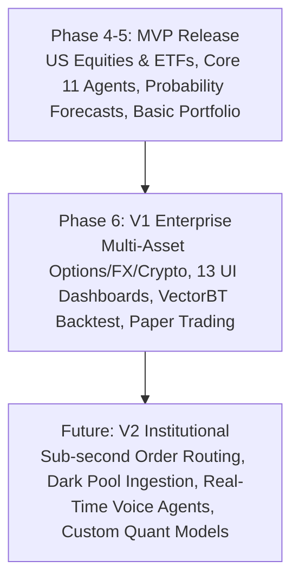

# Document 09: Feature Roadmap & Release Scope Matrix

## Purpose
The **FEATURE_ROADMAP.md** document specifies the detailed feature matrix across Minimum Viable Product (MVP), Version 1.0 (V1 Enterprise), and Version 2.0 (V2 Institutional Institutional) releases for AlphaMind AI.

## Responsibilities
- Categorize product features by release tier (MVP vs V1 vs V2).
- Define feature status, asset class compatibility, and user role availability.
- Provide clear milestone gating criteria for release readiness.

## Feature Matrix Across Release Tiers

---

## Detailed Feature Matrix

| Feature Category | MVP (Phase 4-5) | V1 Enterprise (Phase 6) | V2 Institutional (Post-V1) |
| :--- | :--- | :--- | :--- |
| **Asset Class Support** | US Equities, Global ETFs | Equities, ETFs, Futures, Options, FX, Top 100 Crypto, Bonds | OTC Derivatives, Private Equity, Micro-Cap Penny Stocks |
| **Market Data Providers** | Polygon.io, yfinance, FRED API | Polygon.io, FRED, CCXT, Interactive Brokers API, SEC EDGAR | Bloomberg Terminal API, Refinitiv Eikon, Direct Exchange Feeds |
| **Probability Forecasting** | 10,000-run Monte Carlo, 95% Confidence Intervals | Temporal Fusion Transformers (TFT), XGBoost, CatBoost, Bayesian Calibration | Deep Volatility Surface Skew, Regime-Switching Markov Models |
| **Quant Analytics** | CAPM, Sharpe, Sortino, MaxDD, VaR | Fama-French 3/5 Factor, Cointegration, Pairs Trading, Black-Litterman, HRP | Multi-Factor Risk Attribution, Dynamic DCC-GARCH Correlation |
| **AI Agents & LangGraph** | 11 LangGraph Research Agents, Supervisor Node | Circuit Breakers, Model Fallback Switching, Brier Score Self-Calibration | Voice AI Agents, Custom User Agent Builder Studio |
| **Knowledge Graph** | Neo4j Company-Executive-Product Nodes | 15 Node Types (Supply Chain, Lawsuits, Patents, Macro Events) | Real-time Global Patent NLP Parser, Supply Chain Disruption Predictor |
| **UI Dashboards** | Research, Portfolio, Chat, Settings (4 Dashboards) | All 13 Specialized Interactive Dashboards | Multi-Monitor Trading Desktop Layout, Customized Widget Canvas |
| **Backtesting & Trading** | Historical Performance Simulation | VectorBT Backtesting Engine, Paper Trading Simulation | Direct Broker Execution (Alpaca, Interactive Brokers, Binance) |
| **Security & Compliance** | JWT Auth, Basic Financial Disclaimer | Full RBAC, Vault Secrets, Audit Logs, Rate Limiting | SOC2 Type II Certification, HIPAA/FINRA Institutional Compliance Pack |

---

## Gating Criteria for MVP to V1 Transition

1. **Test Coverage**: > 80% line and branch coverage across all backend services and quantitative libraries.
2. **Probability Forecast Accuracy**: Rolling Brier Score < 0.20 on 30-day directional prediction windows.
3. **SLA Compliance**: 99.5% uptime on WebSocket ticker feeds and < 30s execution SLA on multi-agent research runs.
4. **Compliance Enforcement**: 100% of generated reports and API payloads verified for SEC/FINRA disclaimer injection.

## Dependencies & Sub-System References
- [02. Project Roadmap](file:///Users/kushal/Desktop/AlphaMind%20AI/docs/02_PROJECT_ROADMAP.md)
- [03. System Architecture](file:///Users/kushal/Desktop/AlphaMind%20AI/docs/03_SYSTEM_ARCHITECTURE.md)
- [07. UI/UX Plan](file:///Users/kushal/Desktop/AlphaMind%20AI/docs/07_UI_UX_PLAN.md)
- [17. Prediction Engine](file:///Users/kushal/Desktop/AlphaMind%20AI/docs/17_PREDICTION_ENGINE.md)
