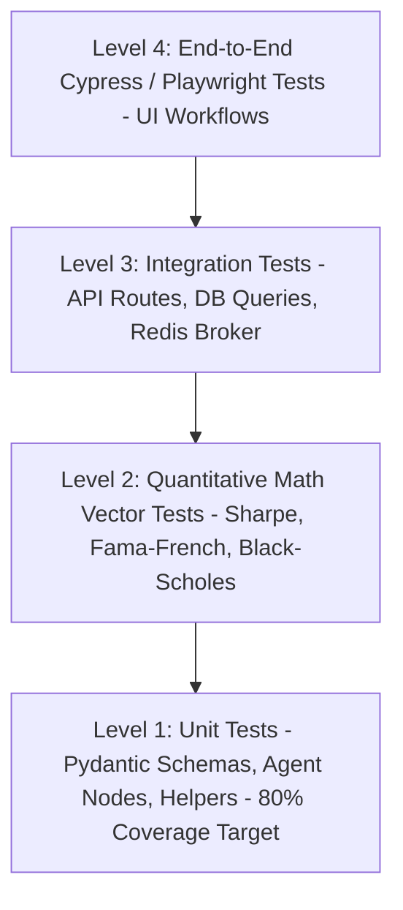

# Document 10: Testing & Verification Strategy

## Purpose
The **TESTING_STRATEGY.md** document specifies the comprehensive quality assurance, unit testing, quantitative validation, integration testing, end-to-end (E2E) UI testing, and mock protocol frameworks for AlphaMind AI.

## Responsibilities
- Mandate minimum 80% line and branch test coverage threshold across all services.
- Define quantitative test suite validation rules against known analytical math vectors.
- Detail API mocking rules (`pytest-mock`, `respx`) prohibiting live API calls during automated CI/CD runs.
- Specify frontend component test patterns (Jest, React Testing Library).

## Multi-Layer Test Automation Pyramid



---

## 1. Quantitative Math Vector Testing Rules

Mathematical functions (e.g., Fama-French regressions, Black-Scholes options pricing, Value at Risk, Sharpe ratio) MUST be verified against known analytical test vectors:

```python
# Example PyTest Analytical Assertion for Sharpe Ratio
import numpy as np
import pytest
from packages.research.quant import calculate_sharpe_ratio

def test_sharpe_ratio_analytical_vector():
    # Synthetic daily returns with known mean and std dev
    returns = np.array([0.01, 0.02, -0.005, 0.015, 0.008, 0.012])
    risk_free_rate = 0.04 / 252 # Daily risk free rate
    
    expected_sharpe = 2.1485 # Known analytical target
    calculated_sharpe = calculate_sharpe_ratio(returns, risk_free_rate, annualize=True)
    
    np.testing.assert_almost_equal(calculated_sharpe, expected_sharpe, decimal=4)
```

---

## 2. API & External Service Mocking Rules

- **Zero Live API Calls in Unit Tests**: Live network requests to `Polygon.io`, `yfinance`, `OpenAI`, `Anthropic`, or `FRED` during automated test runs are **strictly prohibited**.
- Use `respx` for HTTP client mocking (`httpx`) and `pytest-mock` for LLM completions.

```python
# Example RESPX Mocking for External Polygon API
import respx
import httpx
import pytest

@pytest.mark.asyncio
@respx.mock
async def test_polygon_provider_failover():
    # Mock primary provider returning 500 error
    respx.get("https://api.polygon.io/v2/aggs/ticker/AAPL/range/1/day/2026-01-01/2026-08-01").mock(
        return_value=httpx.Response(500, json={"error": "Internal Server Error"})
    )
    # Secondary provider mock
    respx.get("https://www.alphavantage.co/query?function=TIME_SERIES_DAILY&symbol=AAPL").mock(
        return_value=httpx.Response(200, json={"Time Series (Daily)": {}})
    )
    
    # Provider failover manager execution assertion
    ...
```

---

## 3. Test Coverage Enforcement & Command Suite

### Backend Execution Commands
```bash
# Run backend unit & quantitative tests with coverage report
cd apps/backend
pytest --cov=app --cov=packages --cov-report=term-missing --cov-report=html --cov-fail-under=80
```

### Frontend Component Execution Commands
```bash
# Run Next.js Jest component tests & static type-checking
cd apps/frontend
npm run test
npx tsc --noEmit
```

## Dependencies & Sub-System References
- [03. System Architecture](file:///Users/kushal/Desktop/AlphaMind%20AI/docs/03_SYSTEM_ARCHITECTURE.md)
- [08. Development Plan](file:///Users/kushal/Desktop/AlphaMind%20AI/docs/08_DEVELOPMENT_PLAN.md)
- [19. Coding Standards](file:///Users/kushal/Desktop/AlphaMind%20AI/docs/19_CODING_STANDARDS.md)
- [AGENTS.md Permanent Constitution](file:///Users/kushal/Desktop/AlphaMind%20AI/AGENTS.md)
