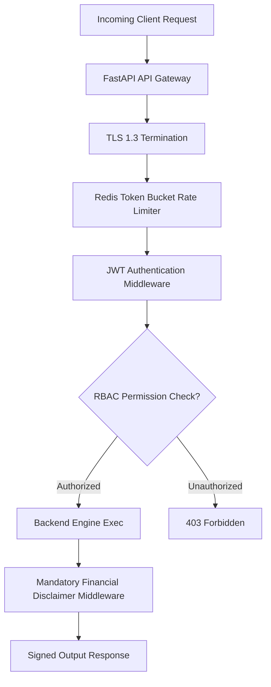

# Document 11: Security, Authorization & Financial Compliance Architecture

## Purpose
The **SECURITY_ARCHITECTURE.md** document specifies the zero-trust security architecture, Role-Based Access Control (RBAC), API key management, Vault secret storage, data encryption at rest and in transit, and regulatory financial disclaimers for AlphaMind AI.

## Responsibilities
- Detail RBAC user permissions model (Admin, Quant, Trader, Viewer).
- Specify JWT authentication, refresh token rotation, and rate limiting policies.
- Detail HashiCorp Vault secret storage for third-party market data and LLM API keys.
- Enforce mandatory SEC/FINRA regulatory financial disclaimers across all API responses and generated research reports.

## Zero-Trust Security Gateway Architecture



---

## 1. Role-Based Access Control (RBAC) Matrix

| User Role | View Market Data & Reports | Submit Chat Research Queries | Execute Paper Trades | Modify Model Registry & API Keys | System Admin Config |
| :--- | :--- | :--- | :--- | :--- | :--- |
| **Guest / Viewer** | Yes | Read-Only | No | No | No |
| **Trader** | Yes | Yes | Yes (Simulated) | No | No |
| **Quant Analyst** | Yes | Yes | Yes | Yes (Read/Write Models) | No |
| **Admin** | Yes | Yes | Yes | Yes | Yes (Full Control) |

---

## 2. Secrets Management & API Key Vault

- **Zero Hardcoded Secrets**: Storing API keys or DB passwords in source code or `.env` files in production is strictly forbidden.
- **HashiCorp Vault / AWS Secrets Manager**: Production environment pulls data provider API keys (`Polygon`, `FRED`) and LLM keys (`OpenAI`, `Anthropic`) dynamically at runtime via authenticated service accounts.
- **Encryption at Rest**: PostgreSQL user data and ChromaDB vector embeddings encrypted via AES-256-GCM.
- **Encryption in Transit**: Mandatory TLS 1.3 for all REST API, WebSocket, and internal gRPC/HTTP communications.

---

## 3. Financial Disclaimer & SEC/FINRA Compliance Engine

Every API endpoint returning generated research reports, probabilities, or trade recommendations MUST automatically wrap responses with the mandatory SEC/FINRA research disclaimer:

```python
# Mandatory Disclaimer Middleware Snippet Blueprint
MANDATORY_SEC_FINRA_DISCLAIMER = (
    "DISCLAIMER: AlphaMind AI is an automated quantitative research engine. "
    "All outputs, probability distributions, confidence intervals, and research signals "
    "are for informational and educational purposes only and do not constitute financial, "
    "investment, legal, or tax advice. Past quantitative performance is no guarantee of "
    "future outcomes. Trading financial instruments carries substantial risk of loss."
)
```

## Dependencies & Sub-System References
- [03. System Architecture](file:///Users/kushal/Desktop/AlphaMind%20AI/docs/03_SYSTEM_ARCHITECTURE.md)
- [05. API Design](file:///Users/kushal/Desktop/AlphaMind%20AI/docs/05_API_DESIGN.md)
- [08. Development Plan](file:///Users/kushal/Desktop/AlphaMind%20AI/docs/08_DEVELOPMENT_PLAN.md)
- [AGENTS.md Permanent Constitution](file:///Users/kushal/Desktop/AlphaMind%20AI/AGENTS.md)
