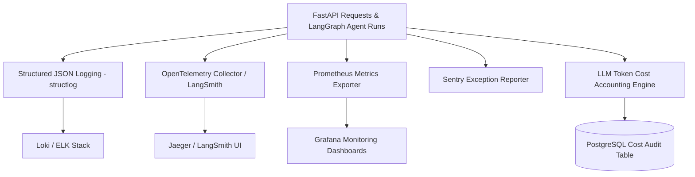

# Document 12: Observability, Distributed Tracing & LLM Cost Accounting

## Purpose
The **OBSERVABILITY.md** document details the logging, distributed tracing, metric collection, error capture, and real-time LLM token cost accounting framework for AlphaMind AI.

## Responsibilities
- Define structured JSON logging standards via `structlog`.
- Specify OpenTelemetry / LangSmith distributed tracing for multi-agent step execution profiling.
- Detail Prometheus metrics collection and Grafana dashboard visualization.
- Implement real-time token cost accounting per LLM provider and agent node.

## Observability Architecture Stack



---

## 1. Structured JSON Logging via `structlog`

All log entries across FastAPI controllers, quantitative engines, and LangGraph agent nodes MUST format logs in structured JSON containing correlation IDs:

```json
{
  "timestamp": "2026-08-04T18:32:00.123Z",
  "level": "info",
  "correlation_id": "corr_948275193",
  "service": "packages/agents/company_agent.py",
  "event": "sec_filing_extracted",
  "ticker": "NVDA",
  "filing_type": "10-K",
  "chunks_processed": 42,
  "execution_time_ms": 1420
}
```

---

## 2. LLM Token Cost Accounting Engine

Every LLM completion across `OpenAI`, `Anthropic`, `Gemini`, `DeepSeek`, or `Ollama` is intercepted by token accounting middleware to record financial cost per research session:

```python
# LLM Token Cost Accounting Table Schema Definition
class LLMTokenUsageAudit(Base):
    __tablename__ = "llm_token_usage_audit"
    
    id = Column(UUID(as_uuid=True), primary_key=True, default=uuid.uuid4)
    session_id = Column(String, index=True)
    agent_name = Column(String, index=True)
    provider = Column(String) # e.g. "openai", "anthropic"
    model_name = Column(String) # e.g. "gpt-4o", "claude-3-5-sonnet"
    prompt_tokens = Column(Integer)
    completion_tokens = Column(Integer)
    total_cost_usd = Column(Numeric(10, 6))
    created_at = Column(DateTime(timezone=True), server_default=func.now())
```

---

## 3. Prometheus Key Performance Indicators (KPIs)

- `alphamind_agent_step_duration_seconds`: Histogram measuring execution latency per agent node.
- `alphamind_data_provider_errors_total`: Counter tracking data provider failover triggers by provider name.
- `alphamind_llm_cost_total_usd`: Counter tracking cumulative API token spend.
- `alphamind_brier_score_rolling`: Gauge tracking model prediction calibration accuracy over 30-day windows.

## Dependencies & Sub-System References
- [03. System Architecture](file:///Users/kushal/Desktop/AlphaMind%20AI/docs/03_SYSTEM_ARCHITECTURE.md)
- [06. Agent Architecture](file:///Users/kushal/Desktop/AlphaMind%20AI/docs/06_AGENT_ARCHITECTURE.md)
- [14. Model Registry](file:///Users/kushal/Desktop/AlphaMind%20AI/docs/14_MODEL_REGISTRY.md)
