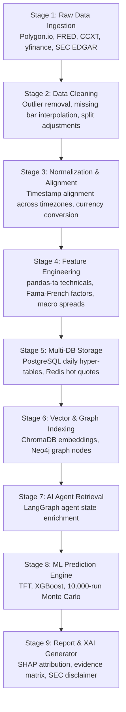

# Document 13: 9-Stage Ingestion & Processing Data Pipeline

## Purpose
The **DATA_PIPELINE.md** document specifies the 9-stage data processing pipeline for AlphaMind AI, detailing raw market data ingestion, data cleaning, normalization, feature engineering, persistence, vector indexing, agent retrieval, ML prediction, and Explainable AI report generation.

## Responsibilities
- Define data schemas and transformations across all 9 pipeline stages.
- Detail feature engineering calculations (Technicals, Fundamentals, Macro factors).
- Specify vector embedding ingestion pipeline for SEC filings and news media.
- Define data quality checks and handling of missing or corrupted ticker data.

## 9-Stage Data Ingestion Pipeline Topology

---

## Detailed Specifications of the 9 Pipeline Stages

### Stage 1: Raw Data Ingestion
- Ingests raw JSON payloads from multi-asset market providers (`Polygon.io`, `FRED`, `CCXT`, `yfinance`) and XML/XBRL text documents from SEC EDGAR.

### Stage 2: Data Cleaning
- Checks for missing trade bars, anomalous spike outliers (> 50% price movement in single 1-minute bar), and performs split/dividend price adjustments.

### Stage 3: Normalization & Time Alignment
- Converts all trade bar timestamps to UTC `TIMESTAMPTZ`.
- Converts foreign currency assets (e.g. FTSE 100 in GBP) to USD base currency using real-time FX rate streams.

### Stage 4: Feature Engineering Engine
Calculates multi-dimensional financial features using `pandas-ta` and quantitative libraries:
- **Technical Features**: RSI(14), MACD(12,26,9), Bollinger Bands(20,2), ATR(14), Stochastic Oscillator, Supertrend.
- **Fundamental Features**: EV/EBITDA, P/E, P/FCF, ROIC, Altman Z-Score, Debt/Equity.
- **Macro Features**: Yield Curve Spread (10Y minus 2Y Treasury yield), Real Interest Rate, CPI YoY % change.

### Stage 5: Multi-Database Storage
- Writes daily price bars and technical features to **TimescaleDB hyper-tables**.
- Caches latest 1-minute hot tick quotes in **Redis key-value store**.

### Stage 6: Vector Store & Knowledge Graph Indexing
- Chunks SEC 10-K filings into 512-token passages, embeds via OpenAI `text-embedding-3-large`, and upserts to **ChromaDB**.
- Extracts company supply chain dependencies and lawsuit mentions into **Neo4j Knowledge Graph**.

### Stage 7: AI Agent Retrieval
- LangGraph agents query ChromaDB vector store and TimescaleDB tables to populate the shared `LangGraph State`.

### Stage 8: ML Prediction Engine
- Ingests state features into Temporal Fusion Transformer (TFT) and XGBoost ensembles, executing 10,000-run Monte Carlo simulations.

### Stage 9: Report & XAI Generation
- Formats final prediction distributions, SHAP feature importance charts, and bull/bear argument matrices into structured markdown reports with mandatory SEC disclaimers.

## Dependencies & Sub-System References
- [03. System Architecture](file:///Users/kushal/Desktop/AlphaMind%20AI/docs/03_SYSTEM_ARCHITECTURE.md)
- [04. Database Design](file:///Users/kushal/Desktop/AlphaMind%20AI/docs/04_DATABASE_DESIGN.md)
- [15. Knowledge Graph](file:///Users/kushal/Desktop/AlphaMind%20AI/docs/15_KNOWLEDGE_GRAPH.md)
- [17. Prediction Engine](file:///Users/kushal/Desktop/AlphaMind%20AI/docs/17_PREDICTION_ENGINE.md)
