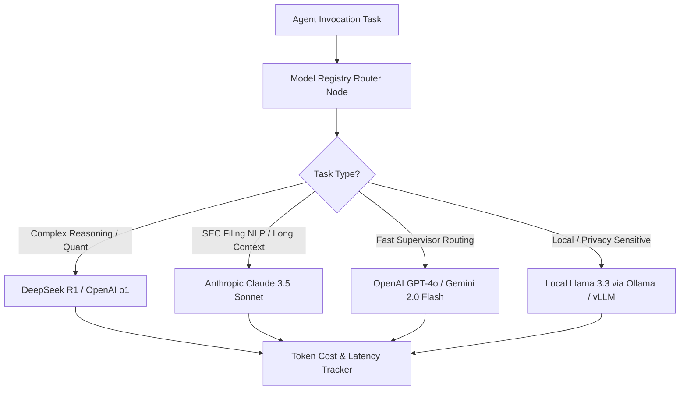

# Document 14: Multi-LLM Model Registry Architecture

## Purpose
The **MODEL_REGISTRY.md** document specifies the centralized Model Registry architecture supporting commercial API models (OpenAI, Anthropic, Gemini, DeepSeek) and open-source local/hosted models (Llama 3.3, Qwen 2.5, Mistral via Ollama or vLLM).

## Responsibilities
- Maintain metadata for all supported LLM providers and models (Context size, Cost, Latency, Capability tags).
- Provide dynamic model routing logic assigning optimal LLM models to specific agent roles.
- Support model fallback switching during API rate limits or outage events.

## Model Registry Architecture & Task Routing



---

## Supported LLM Models & Capability Matrix

| Provider | Model Identifier | Context Window | Input Cost / 1M | Output Cost / 1M | Latency SLA | Key Capabilities | Preferred Agent Task Assignment |
| :--- | :--- | :--- | :--- | :--- | :--- | :--- | :--- |
| **OpenAI** | `gpt-4o` | 128,000 | $2.50 | $10.00 | High (< 500ms) | Structured JSON, Function Calling | Supervisor Routing, Report Generator |
| **Anthropic** | `claude-3-5-sonnet` | 200,000 | $3.00 | $15.00 | Med (< 800ms) | Deep Context NLP, Code, SEC Extraction | Financial Statement & SEC Agent |
| **Google** | `gemini-1.5-pro` | 2,000,000 | $1.25 | $5.00 | Med (< 900ms) | Million-Token Context, Multimodal | News Analysis & Economic Calendar |
| **DeepSeek** | `deepseek-r1` | 64,000 | $0.55 | $2.19 | Med-Slow | Mathematical & Quantitative Reasoning | Prediction & Risk Agent Verification |
| **Meta (Local)** | `llama-3.3-70b-instruct` | 128,000 | $0.00 (Local) | $0.00 (Local) | Local GPU dependent | Zero Data Egress, Privacy Sensitive | Offline Mode / Local Backup Agent |

---

## Model Fallback Switching Protocol

```
Attempt Primary Model Invocation (e.g. Claude 3.5 Sonnet)
  ├── Success -> Return JSON payload
  └── Timeout (> 5s) / Rate Limit 429 / Provider Error 500
        ├── Log Failover Alert in Structured Logs
        ├── Switch to Secondary Model (e.g. GPT-4o)
        └── If Secondary Fails -> Switch to Fallback Model (e.g. Gemini 1.5 Pro)
```

## Dependencies & Sub-System References
- [06. Agent Architecture](file:///Users/kushal/Desktop/AlphaMind%20AI/docs/06_AGENT_ARCHITECTURE.md)
- [11. Security Architecture](file:///Users/kushal/Desktop/AlphaMind%20AI/docs/11_SECURITY_ARCHITECTURE.md)
- [12. Observability](file:///Users/kushal/Desktop/AlphaMind%20AI/docs/12_OBSERVABILITY.md)
