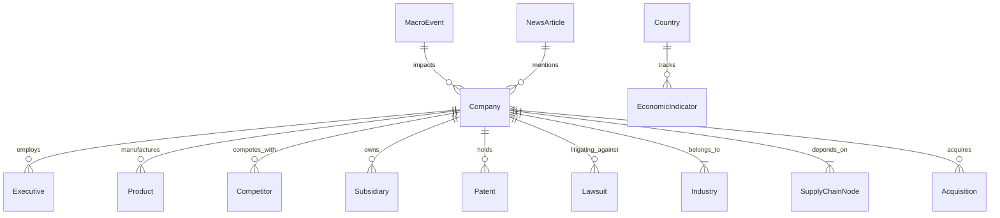

# Document 15: Financial Knowledge Graph Architecture

## Purpose
The **KNOWLEDGE_GRAPH.md** document specifies the Neo4j and NetworkX financial knowledge graph architecture, mapping complex multi-entity relationships between companies, executives, products, competitors, supply chain nodes, lawsuits, patents, and macroeconomic events.

## Responsibilities
- Detail node schema labels and edge relationship types across 15 financial entity domains.
- Specify graph ingestion pipelines from SEC 10-K filings, news NLP, and patent databases.
- Define Cypher query patterns for supply chain bottleneck analysis and executive network linkage.

## Financial Knowledge Graph Entity Relationship Diagram



---

## 1. 15 Core Node Labels & Property Schemas

1. `:Company {symbol: String, name: String, market_cap: Float, sector: String, cik: String}`
2. `:Executive {name: String, title: String, age: Integer, linkedin_id: String}`
3. `:Product {name: String, category: String, annual_revenue: Float}`
4. `:Competitor {market_share_pct: Float}`
5. `:Industry {gics_code: String, sector_name: String}`
6. `:Country {iso_code: String, gdp_usd: Float, inflation_pct: Float}`
7. `:Investor {name: String, fund_type: String, aum_usd: Float}`
8. `:Subsidiary {ownership_pct: Float, jurisdiction: String}`
9. `:Patent {patent_id: String, title: String, filing_date: Date}`
10. `:Lawsuit {case_id: String, court: String, damages_sought: Float}`
11. `:SupplyChainNode {tier: Integer, critical_component: String}`
12. `:NewsArticle {url: String, sentiment_score: Float, timestamp: Datetime}`
13. `:MacroEvent {event_name: String, date: Date, rate_change_bps: Float}`
14. `:Commodity {symbol: String, unit: String}`
15. `:Currency {code: String, peg: String}`

---

## 2. Sample Cypher Query: Supply Chain Bottleneck Analysis

Finding all tier-1 and tier-2 supply chain dependencies for an asset exposed to semiconductor shortages:

```cypher
MATCH (target:Company {symbol: "NVDA"})-[:SUPPLIES_TO|DEPENDS_ON*1..2]-(supplier:Company)
OPTIONAL MATCH (supplier)-[:HEADQUARTERED_IN]->(country:Country)
OPTIONAL MATCH (supplier)-[:IMPACTED_BY]->(event:MacroEvent)
RETURN target.symbol, supplier.name, country.name, event.event_name
ORDER BY supplier.market_cap DESC
```

## Dependencies & Sub-System References
- [04. Database Design](file:///Users/kushal/Desktop/AlphaMind%20AI/docs/04_DATABASE_DESIGN.md)
- [06. Agent Architecture](file:///Users/kushal/Desktop/AlphaMind%20AI/docs/06_AGENT_ARCHITECTURE.md)
- [13. Data Pipeline](file:///Users/kushal/Desktop/AlphaMind%20AI/docs/13_DATA_PIPELINE.md)
