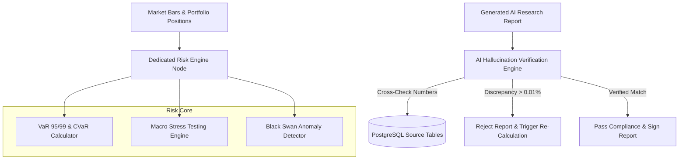

# Document 16: Dedicated Risk Engine Architecture

## Purpose
The **RISK_ENGINE.md** document specifies the dedicated Risk Engine for AlphaMind AI, detailing institutional risk modeling (VaR, CVaR), AI hallucination verification, provider failure risk, liquidity risk, stress testing, and real-time Black Swan anomaly detection.

## Responsibilities
- Compute portfolio and asset-level Value at Risk (VaR 95/99 Parametric & Historical) and Conditional VaR (CVaR).
- Perform AI Hallucination Verification cross-checking generated numbers against source PostgreSQL tables.
- Execute stress tests under macro shock scenarios (e.g. 2008 GFC, 2020 COVID crash).
- Monitor Black Swan triggers (VIX > 35, credit spread spikes) to auto-adjust risk limits.

## Risk Engine Components & Execution Flow

---

## 1. Value at Risk (VaR) & CVaR Formulations

### Parametric Value at Risk ($\text{VaR}_\alpha$)
$$\text{VaR}_\alpha = - (\mu + z_\alpha \cdot \sigma) \cdot P$$
Where:
- $\mu$: Expected portfolio daily return.
- $\sigma$: Daily portfolio standard deviation.
- $z_\alpha$: Standard normal score for confidence level $\alpha$ (e.g., $z_{0.95} = 1.645$, $z_{0.99} = 2.326$).
- $P$: Total portfolio value USD.

### Conditional Value at Risk ($\text{CVaR}_\alpha$ / Expected Shortfall)
$$\text{CVaR}_\alpha = E[L \mid L \ge \text{VaR}_\alpha]$$
Measures the expected loss in the tail scenarios exceeding VaR.

---

## 2. AI Hallucination Verification Algorithm

1. Parse all numerical assertions in generated Markdown text (e.g., *"NVDA Q2 revenue grew 122% to $30.04B"*).
2. Extract source metric keys (`NVDA`, `Q2_2025_REVENUE`, `30040000000`).
3. Query source PostgreSQL `financial_statements` table for exact values.
4. Calculate percentage difference:
   $$\text{Error} = \left| \frac{\text{Reported Value} - \text{Source Value}}{\text{Source Value}} \right|$$
5. If $\text{Error} > 0.0001$ ($0.01\%$), flag report as hallucinated, halt execution, log error, and rerun report generator node.

---

## 3. Black Swan Anomaly Triggers
- **VIX Volatility Index Spike**: VIX > 35 triggers automatic reduction of paper trading leverage and increases cash reserve buffer to 40%.
- **Credit Spread Widening**: High Yield OAS spread > 600 bps triggers alert in Risk Dashboard.

## Dependencies & Sub-System References
- [03. System Architecture](file:///Users/kushal/Desktop/AlphaMind%20AI/docs/03_SYSTEM_ARCHITECTURE.md)
- [06. Agent Architecture](file:///Users/kushal/Desktop/AlphaMind%20AI/docs/06_AGENT_ARCHITECTURE.md)
- [17. Prediction Engine](file:///Users/kushal/Desktop/AlphaMind%20AI/docs/17_PREDICTION_ENGINE.md)
