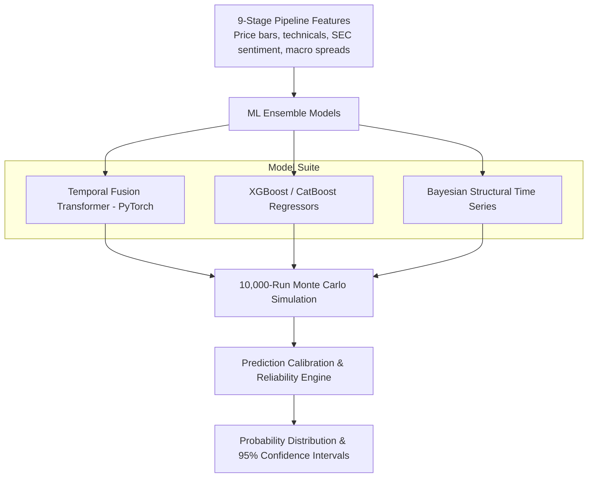

# Document 17: ML & Probability Prediction Engine

## Purpose
The **PREDICTION_ENGINE.md** document specifies the Machine Learning and Probability Prediction Engine for AlphaMind AI, detailing model architecture, Temporal Fusion Transformers (TFT), XGBoost, CatBoost, Bayesian inference, and 10,000-run Monte Carlo simulations.

## Responsibilities
- Reject deterministic single-point target prices in favor of probabilistic distributions and 95% confidence intervals.
- Enforce Temporal Fusion Transformer (TFT) multi-horizon forecasting with dynamic feature attention.
- Run 10,000-iteration Monte Carlo simulations using Student's t heavy-tailed distributions.
- Calibrate model predictions and compute rolling Brier Scores.

## ML Prediction Pipeline Topology



---

## 1. Probability Distribution Output Schema

Every forecast generated by the Prediction Engine conforms to the `ProbabilityDistributionForecast` contract:

```python
class ProbabilityDistributionForecast(BaseModel):
    asset_symbol: str
    horizon_days: int # e.g. 30 days
    current_price: float
    
    # Probabilistic Scenario Matrix
    bull_scenario_probability: float # e.g. 0.25 (25%)
    base_scenario_probability: float # e.g. 0.60 (60%)
    bear_scenario_probability: float # e.g. 0.15 (15%)
    
    # 95% Confidence Intervals
    expected_return_pct: float # e.g. +4.5%
    ci_95_lower_bound_pct: float # e.g. -5.2%
    ci_95_upper_bound_pct: float # e.g. +12.8%
    
    # Calibration & Reliability
    brier_score_historical: float # e.g. 0.12
    data_quality_score: float # e.g. 0.96
```

---

## 2. 10,000-Iteration Heavy-Tailed Monte Carlo Simulation

Simulates price trajectory paths drawing from a Student's t-distribution ($\nu = 4$ degrees of freedom to capture fat tails and market crash jumps):

$$\Delta S = \mu S \Delta t + \sigma S \epsilon \sqrt{\Delta t}, \quad \epsilon \sim t_{\nu=4}$$

- **Outputs**: 10,000 simulated price paths over $T$ days, generating empirical percentiles ($P_5, P_{25}, P_{50}, P_{75}, P_{95}$).

---

## 3. Forecast Calibration & Brier Score Calculation

Measures probability accuracy against empirical market outcomes:

$$\text{BS} = \frac{1}{N} \sum_{t=1}^N (f_t - o_t)^2$$

Where $f_t$ is the forecast probability and $o_t \in \{0, 1\}$ is the binary outcome. Lower Brier Score ($< 0.15$) indicates superior model calibration.

## Dependencies & Sub-System References
- [03. System Architecture](file:///Users/kushal/Desktop/AlphaMind%20AI/docs/03_SYSTEM_ARCHITECTURE.md)
- [06. Agent Architecture](file:///Users/kushal/Desktop/AlphaMind%20AI/docs/06_AGENT_ARCHITECTURE.md)
- [14. Model Registry](file:///Users/kushal/Desktop/AlphaMind%20AI/docs/14_MODEL_REGISTRY.md)
- [16. Risk Engine](file:///Users/kushal/Desktop/AlphaMind%20AI/docs/16_RISK_ENGINE.md)
