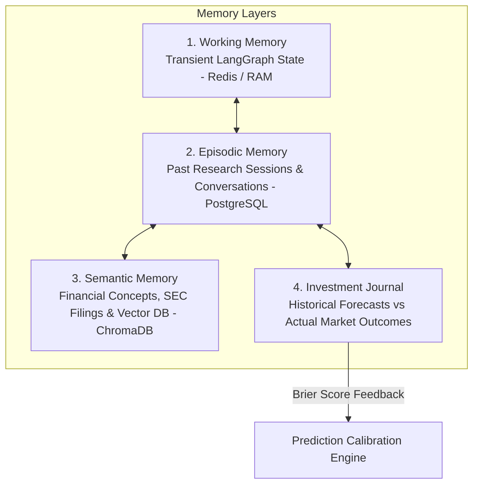

# Document 18: Hierarchical AI Memory System

## Purpose
The **MEMORY_SYSTEM.md** document specifies the multi-tier Hierarchical AI Memory architecture for AlphaMind AI, combining Working Memory (LangGraph State), Episodic Memory (Research Sessions), Semantic Memory (ChromaDB Vector Base), and an **Investment Journal** for self-learning and calibration.

## Responsibilities
- Manage short-term state persistence across agent execution steps.
- Retain long-term episodic memory of past research findings and user interactions.
- Record historical forecasts vs actual market outcomes in the Investment Journal for continuous model evaluation.

## Hierarchical Memory Architecture

---

## 1. 4 Memory Tiers Specifications

### Tier 1: Working Memory (`WorkingMemory`)
- **Scope**: Transient state for an active LangGraph research run.
- **Storage**: In-memory Redis key `agent_state:{session_id}` (TTL: 1 hour).
- **Contents**: Unprocessed market bars, SEC filing chunks, raw agent outputs.

### Tier 2: Episodic Memory (`EpisodicMemory`)
- **Scope**: Historical record of user research sessions, chat conversations, and previous analysis summaries.
- **Storage**: PostgreSQL relational table `research_sessions` indexed on `user_id` and `timestamp`.

### Tier 3: Semantic Memory (`SemanticMemory`)
- **Scope**: Generalized financial domain knowledge, company risk profiles, and vector embeddings of SEC filings and financial news.
- **Storage**: ChromaDB vector collections (`sec_filings_collection`, `news_articles_collection`).

### Tier 4: Investment Journal (`InvestmentJournal`)
- **Scope**: Immutable audit log of every probabilistic prediction generated by AlphaMind AI alongside actual empirical market outcomes 30, 60, and 90 days later.
- **Storage**: PostgreSQL table `investment_journal`.
- **Purpose**: Compute rolling Brier Scores and calibrate future LLM confidence scores.

## Dependencies & Sub-System References
- [04. Database Design](file:///Users/kushal/Desktop/AlphaMind%20AI/docs/04_DATABASE_DESIGN.md)
- [06. Agent Architecture](file:///Users/kushal/Desktop/AlphaMind%20AI/docs/06_AGENT_ARCHITECTURE.md)
- [17. Prediction Engine](file:///Users/kushal/Desktop/AlphaMind%20AI/docs/17_PREDICTION_ENGINE.md)
