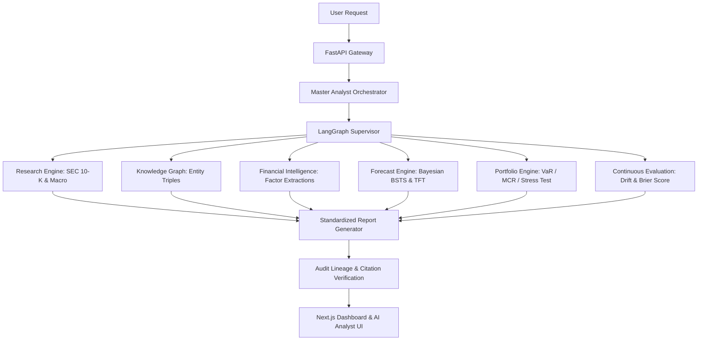
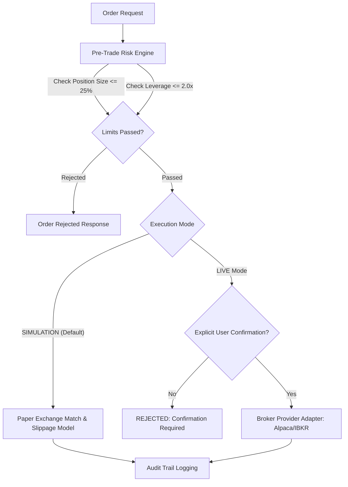

# AlphaMind AI — v1.0 Architecture Diagrams

## 1. End-to-End Autonomous AI Analyst Flow

```mermaid
graph TD
    A[User Request] --> B[FastAPI Gateway]
    B --> C[Master Analyst Orchestrator]
    C --> D[LangGraph Supervisor]
    
    D --> E[Research Engine: SEC 10-K & Macro]
    D --> F[Knowledge Graph: Entity Triples]
    D --> G[Financial Intelligence: Factor Extractions]
    D --> H[Forecast Engine: Bayesian BSTS & TFT]
    D --> I[Portfolio Engine: VaR / MCR / Stress Test]
    D --> J[Continuous Evaluation: Drift & Brier Score]

    E & F & G & H & I & J --> K[Standardized Report Generator]
    K --> L[Audit Lineage & Citation Verification]
    L --> M[Next.js Dashboard & AI Analyst UI]
```

## 2. Execution Simulation & Broker Pre-Live Risk Gate

```mermaid
graph TD
    A[Order Request] --> B[Pre-Trade Risk Engine]
    B -- Check Position Size <= 25% --> C{Limits Passed?}
    B -- Check Leverage <= 2.0x --> C
    
    C -- Rejected --> D[Order Rejected Response]
    C -- Passed --> E{Execution Mode}
    
    E -- SIMULATION (Default) --> F[Paper Exchange Match & Slippage Model]
    E -- LIVE Mode --> G{Explicit User Confirmation?}
    
    G -- No --> H[REJECTED: Confirmation Required]
    G -- Yes --> I[Broker Provider Adapter: Alpaca/IBKR]
    
    F & I --> J[Audit Trail Logging]
```
